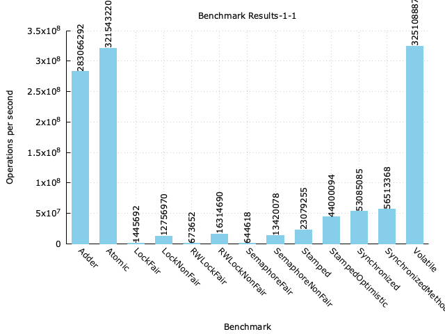
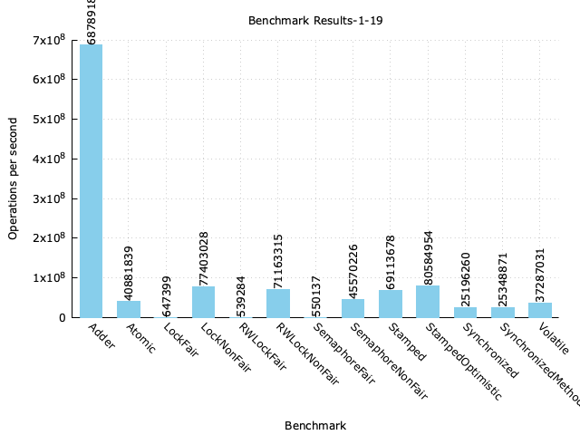
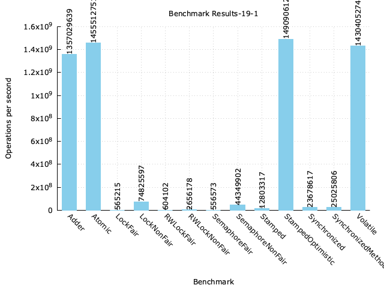

# Concurrent in Java Note

Khi lập trình đa luồng việc đảm bảo tính **threadsafe**, **visiable**,... là rất quan trọng.
Để đạt được mục đích này, **Java** cung cấp rất nhiều phương pháp trong **package java.util.concurrent**

Bài viết này sẽ cung cấp cho các bạn đầy đủ những kiến thức về lớp này để có thể áp dụng vào các **project** của mình.

Bài này có thể hơi dài nên các bạn lưu lại đọc dần nhé :))

## 1. Reentrant là gì?

Khi lập trình hoặc các tài liệu về **concurrent** thường sẽ đề cập đến khái niệm **Reentrant**, **Reentrant Lock**.
Vậy cụ thể tính **Reentrant** là gì? Xét ví dụ sau:

```java
public class ReentrantTest {

    private final Object object = new Object();

    public void setA() {
        synchronized (object) {
            System.out.println("setA");
            setB();
        }
    }

    public void setB() {
        synchronized (object) {
            System.out.println("setB");
        }
    }

    public static void main(String[] args) {
        ReentrantTest t = new ReentrantTest();
        t.setA();
    }
}
```

Nếu **Lock** được sử dụng trong hàm **main()** bên trên không phải dạng **Reentrant** thì sẽ gây ra deadlock và không
thể kết thúc được chương trình.

Trong **Java** có các loại **reentrant lock** sau :

- synchronized
- Các lock kế thừa từ class **ReentrantLock.java**. Trong quá trình làm việc của mình thì chỉ có một **Lock** không **
  Reentrant** đó là **StampedLock**

## 2. FairSync vs NonfairSync

Xét ví dụ khai báo **ReentrantLock** : `var lock = new ReentrantLock();`. Click vào trong lớp `ReentrantLock.java` ta
thấy được hàm khởi tạo sau ta sẽ thấy **FairSync** và **NonfairSync**

```java
    /**
 * Creates an instance of {@code ReentrantLock}.
 * This is equivalent to using {@code ReentrantLock(false)}.
 */
public ReentrantLock(){
        sync=new NonfairSync();
        }

/**
 * Creates an instance of {@code ReentrantLock} with the
 * given fairness policy.
 *
 * @param fair {@code true} if this lock should use a fair ordering policy
 */
public ReentrantLock(boolean fair){
        sync=fair?new FairSync():new NonfairSync();
        }

```

Giả sử ta có 3 **thread**: **T1,T2,T3** cùng muốn truy cập một tài nguyên **R**. Theo thứ tự thời gian thì **T1** đến
trước sau đó lần lượt là **T2** và **T3**.
**T2**, **T3** đến sau nên phải đợi **T1** release Lock mới có thể truy cập tài nguyên của **R**.

Vậy bài toán ở đây là sau khi **T1** release Lock thì **T1** hay **T2** sẽ là luồng tiếp theo lấy được **Lock**.

Để giải quyết bài toán này **Java** có 2 chiến thuật :

+ FairSync: đảm bảo được thứ tự luồng nào chờ lâu nhất thì sẽ lấy được lock. Trong ví dụ trên là **T2**
+ NonfairSync: không đảm bảo thứ tự, bất cứ luồng nào đang chờ đều có thể lấy được lock.

### 2.1 Hiệu năng của FairSync vs NonfairSync

Dựa vào hàm khởi tạo mặc định **Lock** của **Java** thì chúng ta có thể đoán được **NonfairSync** sẽ mang lại hiệu năng
tốt hơn.

**NonfairSync** mang lại hiệu năng cao hơn vì 2 lý do sau :

- Nó không cần quan tâm đến thứ tự các **thread** nên sẽ không phải duy trì thêm một cấu trúc dữ liệu để phục vụ cho
  điều này
  vì vậy code phần này sẽ đơn giản hơn nhiều. Ngược lại **FairSync** cần phải sử dụng thêm cấu trúc dữ liệu **
  AbstractQueuedSynchronizer** để xác định được thứ tự sử dụng **lock**
- Khi đánh thức tất cả các **thread** thì sẽ có **thread** dậy nhanh, **thread** dậy chậm.
  Vì vậy **thread** dậy trước sẽ lấy **lock** và thực hiện **logic** trước và sau đó nó sẽ trả lại **lock** cho các **
  thread** sau. Vì vậy sẽ tăng được hiệu năng sử dụng.

Giả sử ta có theo thời gian ta có **thread T1, T2, T3**. **T2, T3** đang chờ **lock** được trả lại của **T1**

- Thời gian cần để thức dậy của T3 là w3 = 1ms
- Thời gian thực hiện loigc của T3 là l3 = 1ms
- Thời gian cần để thức dậy của T2 là w2 = 3ms
- Thời gian thực hiện loigc của T2 là l2 = 2ms

Tổng thời gian để thực hiện xong logic của **T2,T3** là:

- FairSync : w2 + l2 + w3 + l3 = 3 + 2 + 1 +1 = **7 ms**
- NonfairSync: w3 +l3+ (w2 - w3 + l3) + l2 = 1 + 1+ (3 -1 -1 )+ 2 = **5 ms**


Mặc định của các loại **lock** của Java sẽ sử dụng cách thức **NonfairSync** , vì nó mạng lại hiệu năng cao hơn với
phương pháp **FairSync**.
**synchronized** sẽ sử dụng **NonfairSync**. Sẽ có **benchmark** bên dưới.

## 3. synchronized

**synchronized**  là một loại **lock** của Java, khi một thread gọi phương thức trong **synchronized block** thì nó sẽ
tự động acquires một **intrinsic lock**.

**synchronized** là một dạng **reentrant** vì vậy trong ví dụ đầu tiên sẽ không bị **deadlock**. **synchronized**  chỉ
hỗ trợ **NonfairSync**.

Các dữ liệu được thay đổi trong **synchronized**  block sẽ được tất cả **các luồng nhìn thấy**.

## 4. ReentrantLock

**ReentrantLock** chắc chắn sẽ là **reentrant**, nó hỗ trợ cả 2 loại **NonfairSync** và **FairSync**. Mặc định sẽ sử
dụng chiến thuật **NonfairSync**.

Các **dữ liệu** được thay đổi trong **ReentrantLock** hoặc **bất cứ loại lock** nào **đều được các luồng nhìn thấy** khi
thực hiện **acquires lock**

**ReentrantLock** implement interface **Lock** vì vậy nó cũng cấp thêm một số **API** mà **synchronized** không có như :

- Hỗ trợ timeout khi acquires lock
- tryLock() sẽ **không** **block** lại **thread** mà trả lại kết quả luôn là có acquires lock hay không

Sử dụng **Lock interface** thì lưu ý luôn luôn phải **unlock** tốt nhất nên dùng **finally** để tránh trường hợp **
deadlock**.

## 5. Benchmark concurrent in Java

Các ảnh **benchmark** bên dưới được đo bởi phiên bản Java 11, theo throughput, Code đo hiệu năng
tại [Link](https://github.com/chrishantha/microbenchmarks/tree/v0.0.1-initial-counter-impl/counters).

Một luồng đọc và luồng ghi

Một luồng đọc và 19 luồng ghi

19 luồng đọc và một luồng ghi.

Vì chưa tìm ra được chế độ để upload **gallery** trên **github** nên mọi người xem đầy đủ các hình ảnh benchmark
tại [benchmark-result](blog-picture/benchmark)

## 6. Segment Lock

Đây không phải một **Lock** của **Java**, đây chỉ là một chiến thuật sử dụng **Lock** hiệu quả. Thiết kế này chia **tài
nguyên** cần khóa thành các
**segment** và một **segment** sẽ được kiểm soát độc lập với nhau.

Cách thiết kế này được sử dụng trong **ConcurrentHashMap** của **Java**, **ConcurrentHashMap** có hàm khởi tạo sau:

```java
public ConcurrentHashMap(int initialCapacity,float loadFactor,int concurrencyLevel);
```

Từ **Java version < 1.8** giả sử **concurrencyLevel=16** ở đây nghĩa sẽ có **tối đa 16 thread** có thể thay đổi dữ liệu
trong **ConcurrentHashMap** thay vì chỉ 1
thread có quyền ghi vào **Map**.

Implement ConcurrentHashMap Java
1.7 [ConcurrentHashMap java 1.7](https://github.com/openjdk-mirror/jdk7u-jdk/blob/f4d80957e89a19a29bb9f9807d2a28351ed7f7df/src/share/classes/java/util/concurrent/ConcurrentHashMap.java#L1055)

Từ **Java version >=1.8** _concurrentLevel_ không còn ý nghĩa để giới hạn luồng ghi nữa, _ConcurrentHashMap_ của phiên
bản này đã chuyển sang implement
bằng **Unsafe** và ít **Lock** hơn rất nhiều, cụ thể như sau:

- Nếu **hashslot** hiện tại còn trống thì sẽ sử dụng lệnh **U.compareAndSetObject(tab, ((long)i << ASHIFT) + ABASE, c,
  v);** để thêm **object** vào **hashTable**, hàm này không **block**
- Nếu **hashslot** đã có Object ghi vào thì sử dụng **synchronized** cho duy nhất **hashslot** đó để thực hiện ghi. Vì
  vậy **số thread tối đa** được có quyền thay đổi ConcurrentHashMap sẽ **là số lượng hashslot**

Chi tiết Implement ConcurrentHashMap Java 11
tại [ConcurrentHashMap java 11](https://github.com/AdoptOpenJDK/openjdk-jdk11/blob/19fb8f93c59dfd791f62d41f332db9e306bc1422/src/java.base/share/classes/java/util/concurrent/ConcurrentHashMap.java#L1010)

```java
    final V putVal(K key,V value,boolean onlyIfAbsent){
        if(key==null||value==null)throw new NullPointerException();
        int hash=spread(key.hashCode());
        int binCount=0;
        for(Node<K, V>[]tab=table;;){
        Node<K, V> f;int n,i,fh;K fk;V fv;
        if(tab==null||(n=tab.length)==0)
        tab=initTable();
        else if((f=tabAt(tab,i=(n-1)&hash))==null){
        if(casTabAt(tab,i,null,new Node<K, V>(hash,key,value)))
        break;  // no lock when adding to empty bin
        }
        else if((fh=f.hash)==MOVED)
        tab=helpTransfer(tab,f);
        else if(onlyIfAbsent // check first node without acquiring lock
        &&fh==hash
        &&((fk=f.key)==key||(fk!=null&&key.equals(fk)))
        &&(fv=f.val)!=null)
        return fv;
        else{
        V oldVal=null;
synchronized (f){ // lock here
        if(tabAt(tab,i)==f){
        if(fh>=0){
        //............................
        }
        }
```

## 7. ReentrantReadWriteLock

**synchronized** và **ReentrantLock** là các khóa độc quyền (**Exclusive lock**), nghĩa là trong một thời điểm chỉ có **
duy nhất một thread có quyền truy cập** và giao
tiếp với tài nguyên dùng chung.

Nhưng sẽ có rất nhiều chương trình có **yêu cầu đọc nhiều hơn rất nhiều** so với yêu cầu ghi. Sử dụng **Exclusive lock**
sẽ làm
giảm hiệu năng sử dụng trong trường hợp này.

Để nâng cao hiệu năng thì cần sử dụng một **shared lock** để các **thread** có thể cùng lúc có thể **đọc dữ liệu dùng
chung**.

**ReentrantReadWriteLock** là một giải pháp cho các chương trình trên, nó cung cấp 2 loại **Lock**:

- **readlock** : Dùng để **read**. Nhiều luồng có thể đọc dữ liệu cùng một lúc nếu không có luồng **update** dữ liệu
- **writelock** : Dùng để **write**. Chỉ có 1 luồng được **update** dữ liệu tại một thời điểm.

Hiểu sâu hơn về **ReentrantReadWriteLock** cần phải trả lời được một số câu hỏi sau :

- Có quá nhiều ReadLock đang chờ **acquire**() thì **writelock** sẽ phải chờ cho đến khi nào nữa thì mới có thể **
  accquire** được lock.
- Khi một thread release writelock, thời điểm đó có yêu cầu accquire() của nhiều readlock() và writelock() thì
  readlock() hay writelock() sẽ được acquire(). Nếu readlock() được acquire thì sẽ tăng tính concurrent nhưng sẽ lại làm
  đói writelock

Tại phiên bản **Java 11** thì _ReentrantReadWriteLock_ đang được implement để thiên vị hơn cho **writelock**.

Tạo điều kiện tối đa cho **writelock** có thể **acquire** được **Lock**. Cụ thể khi đọc mã nguồn của **
ReentrantReadWriteLock** khi thực hiện **acquire**() :

- **readlock** : Một **thread** muốn **acquire readlock()** phải kiểm tra trong **AbstractQueuedSynchronizer** có **
  writeLock()** chờ được **acquire** hay không.
- **writelock** :
    - Nếu **lock** có thể **acquire** (hiện tại không có **readlock/writelock**) thì thực hiện acquire và đánh dấu
      writelock đang giữ lock.
    - Nếu **lock** không thể **acquire** thì thực hiện ghi **writeLock** vào đầu **AbstractQueuedSynchronizer**, để được
      ưu tiên **acquire**

## 8. StampedLock

**StampedLock** là một loại lock mới cung cấp 3 loại lock: **ReadLock**, **WriteLock** và **Optimistic Read**.

**StampedLock** **không** có tính chất **Reentrant**.

**Optimistic Read** sẽ mang lại 2 ưu điểm sau :

- **Optimistic Read** không phải là một **Lock** thế nên tốc độ của nó sẽ nhanh hơn **readLock**
- **Write Thread** sẽ không bị block khi có rất nhiều thread thực hiện **Optimistic Read**.

Pattern hay sử dụng với Optimistic Read như sau, tham khảo java
doc [StampedLock Java Doc](https://docs.oracle.com/javase/8/docs/api/java/util/concurrent/locks/StampedLock.html)

Theo benchmark thì **StampedLock** sẽ có tốc độ hơn rất nhiều so với **ReentrantReadWriteLock** khi có rất nhiều luồng
đọc và ít luồng ghi.

## 9. Condition, wait(), notify(), notifyAll()

Trong lập trình đơn luồng chúng ta sử dụng **if-else** để kiểm tra điều kiện sau đó thực hiện **logic**.

Trong lập trình **đa luồng** việc dùng **if-else** sẽ không khả thi bởi vì **điều kiện** sẽ được một **thread** khác
thay đổi vậy nên sử dụng **if-else** sẽ không kết luận được gì cả.

Vì vậy chúng ta cần có một cơ chế để **thực hiện giao tiếp** giữa các **Thread** với nhau, để phục vụ điều đó chúng ta
có interface **Condition**.

Nếu không sử dụng **Condition**, trong bài toán **consumer-producer**, các **Thread** giao tiếp thông qua một **
threadsafe queue** có thể phải
**implement** consumer như sau:

```java
    public V take()throws InterruptedException{
        while(true){
            synchronized (this){
                if(!isEmpty())
                     return doTake();
                }
            Thread.sleep(100);
        }
    }
```

**Thread** sẽ phải **sleep()** một khoảng thời gian nhất định rồi kiểm tra lại xem đã có dữ liệu với trong **queue**
chưa, điều này hiển nhiên là lãng phí.

Khi sử dụng **Condition** thì sẽ tiết kiệm hơn rất nhiều. Ví dụ method **take()** của **ArrayBlockingQueue**

```java
    public E take()throws InterruptedException{
        final ReentrantLock lock=this.lock;
        lock.lockInterruptibly();
        try{
            while(count==0)
                notEmpty.await();
            return dequeue();
        }finally{
            lock.unlock();
        }
    }
```

**notEmpty** ở đây sẽ là một **Condition** dùng để giao tiếp giữa các luồng consumer và producer. khi notEmpty.await()
thì **thread** sẽ release lock,sau khi được **thread** khác đánh thức thì thread đang chờ **bắt buộc phải acquire được
lock** trước khi thực hiện tiếp logic

Pattern khi sử dụng Condition thông thường sẽ là :

```java
        acquire lock on object state 
        while(precondition does not hold){
            release lock
            wait until precondition might hold
            reacquire lock
        }
        perform action
        release lock
        (Java concurrent in practive)
```

Một số lưu ý khi sử dụng **object.wait()** hay **Condition** :

- Nên sử dụng notifyAll()
- Thread gọi notifyAll(), await(), wait() ,... nên là Thread **acquired lock**.
- Nên để điều kiện check trong vòng lặp while() thay vì if-else. Bởi vì chúng ta cần thiết phải check lại điều kiện
  trước khi gọi await() và sau khi
  được trả về từ await() vì trong môi trường multiThread có thể điều kiện đã bị một Thread khác thay đổi.

## 10. LongAdder

Trong ảnh **benchmark** bên trên chúng ta thấy một class khá mới là **LongAdder**. Lớp này có hiệu năng cực kỳ cao khi
có nhiều luồng cùng thực hiện
ghi vào. Lý do là lớp này đã sử dụng cơ chế **segment** khi có tương tranh khi ghi ( >= 2 luồng cùng thực hiện ghi vào
LongAdder) và nguyên tắc **padding** dữ liệu cho các
**segment** này.

**padding** là cơ chế chống lại **false-sharing** tại tầng Cache L1,L2,L3 của CPU. Bài viết về kỹ thuật này đã được giới
thiệu qua tại [Mechanical-sympathy](Mechanical-sympathy.md),
tương lai sẽ có bài riêng nói rõ hơn về cơ chế **happen-before** và **padding**.

Cụ thể ta xét code của LongAdder.

```java
public class LongAdder extends Striped64 implements Serializable {
    transient volatile Cell[] cells;
    transient volatile long base;

    public void add(long x) {
        Cell[] cs;
        long b, v;
        int m;
        Cell c;
        if ((cs = cells) != null || !casBase(b = base, b + x)) {
            boolean uncontended = true;
            if (cs == null || (m = cs.length - 1) < 0 ||
                    (c = cs[getProbe() & m]) == null ||
                    !(uncontended = c.cas(v = c.value, v + x)))
                longAccumulate(x, null, uncontended);
        }
    }

    public long sum() {
        Cell[] cs = cells;
        long sum = base;
        if (cs != null) {
            for (Cell c : cs)
                if (c != null)
                    sum += c.value;
        }
        return sum;
    }
}

@jdk.internal.vm.annotation.Contended
static final class Cell {
    volatile long value;

    Cell(long x) {
        value = x;
    }

    final boolean cas(long cmp, long val) {
        return VALUE.compareAndSet(this, cmp, val);
    }

    final void reset() {
        VALUE.setVolatile(this, 0L);
    }

    final void reset(long identity) {
        VALUE.setVolatile(this, identity);
    }

    final long getAndSet(long val) {
        return (long) VALUE.getAndSet(this, val);
    }

    // VarHandle mechanics
    private static final VarHandle VALUE;

    static {
        try {
            MethodHandles.Lookup l = MethodHandles.lookup();
            VALUE = l.findVarHandle(Cell.class, "value", long.class);
        } catch (ReflectiveOperationException e) {
            throw new ExceptionInInitializerError(e);
        }
    }
}
```

Tại hàm add(long x) cũng tương tự như các lớp **Atomic**, **LongAdder** cũng dùng cơ chế **CAS** để thực hiện thay đổi biến volatile long base.

Nhưng có **chút khác biệt** là khi thực hiện **CAS** bị **false** hoặc trước đó đã có lần bị false thì **ngay lập tức tìm Cell** tương ứng với luồng thực hiện hàm **add()**.
Sau đó thực hiện **CAS** trên lớp Cell này.

Lớp **Cell** được đánh dấu là **Contended** thì JVM sẽ thực hiện **padding** các dữ liệu trong lớp này để tránh trường hợp **false sharing**.

**False Sharing** có thể sảy ra tại lớp **LongAdder** vì các **thread** **không bị block** khi thực hiện **CAS** trên lớp **Cell**. 
Và lớp **LongAdder** này lại lưu một **mảng Cell**, vậy rất có thể xảy ra trường hợp một **thread** thay đổi giá trị của **Cell** sẽ có thể khiến các thread đang thay đổi cell khác **bị invalid cache**.

## 11. CountDownLatch, Semaphore, Atomic

# Lời kết
Trên đây là các khái niệm cơ bản mình nghĩ các bạn cần phải nắm rõ để quá trình làm việc dễ dàng hơn, kèm theo đó cũng là một số kiến thực mình tự 
tìm hiểu và tổng hợp được trong quá trình làm việc. Nó sẽ phát huy khá nhiều trong quá trình phỏng vấn của các bạn đó.

Bài này khá dài rồi nên phần **visiable** mình sẽ viết tại bài **blog** của tháng sau. Hy vọng bài này cung cấp cho các bạn một chút kiến
thức để trong quá trình làm việc hiệu quả hơn. 

Nếu bài này hay thì cho mình **Star** trên [github](https://github.com/trandem/blog) nhé.


