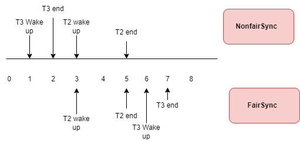

# Java Lock in practice

Khi lập trình đa luồng việc đảm bảo tính **threadsafe**, **visiable**,... là rất quan trọng.
Để đạt được mục đích này, **Java** cung cấp rất nhiều phương pháp trong **package java.util.concurrent**

Bài viết này sẽ cung cấp cho các bạn đầy đủ những kiến thức về lớp này để có thể áp dụng vào các **project** của mình.

Bài này có thể hơi dài nên các bạn lưu lại đọc dần nhé :))

## 1. Reentrant là gì?
Khi lập trình hoặc các tài liệu về **concurrent** thường sẽ đề cập đến khái niệm **Reentrant**, **Reentrant Lock**.
Vậy cụ thể tính **Reentrant** là gì? Xét ví dụ sau:

```java
public class ReentrantTest {
 
    private final Object object = new Object();
 
    public void setA() {
        synchronized (object) {
            System.out.println("setA");
            setB();
        }
    }
 
    public void setB() {
        synchronized (object) {
            System.out.println("setB");
        }
    }
 
    public static void main (String[]args){
        ReentrantTest t = new ReentrantTest();
        t.setA();
    }
}
```
Nếu **Lock** được sử dụng trong hàm **main()** bên trên không phải dạng **Reentrant** thì sẽ gây ra deadlock và không thể kết thúc được chương trình.

Trong **Java** có các loại **reentrant lock** sau :
- synchronized  
- Các lock kế thừa từ class **ReentrantLock.java**. Trong quá trình làm việc của mình thì chỉ có một **Lock** không **Reentrant** đó là **StampedLock**

## 2. FairSync vs NonfairSync
Xét ví dụ khai báo **ReentrantLock** : `var lock = new ReentrantLock();`. Click vào trong lớp `ReentrantLock.java` ta thấy được hàm khởi tạo sau ta sẽ thấy **FairSync** và **NonfairSync**

```java
    /**
 * Creates an instance of {@code ReentrantLock}.
 * This is equivalent to using {@code ReentrantLock(false)}.
 */
public ReentrantLock() {
  sync = new NonfairSync();
}

/**
 * Creates an instance of {@code ReentrantLock} with the
 * given fairness policy.
 *
 * @param fair {@code true} if this lock should use a fair ordering policy
 */
public ReentrantLock(boolean fair) {
        sync = fair ? new FairSync() : new NonfairSync();
}

```
Giả sử ta có 3 **thread**: **T1,T2,T3** cùng muốn truy cập một tài nguyên **R**. Theo thứ tự thời gian thì **T1** đến trước sau đó lần lượt là **T2** và **T3**.
**T2**, **T3** đến sau nên phải đợi **T1** release Lock mới có thể truy cập tài nguyên của **R**.

Vậy bài toán ở đây là sau khi **T1** release Lock thì **T1** hay **T2** sẽ là luồng tiếp theo lấy được **Lock**.

Để giải quyết bài toán này **Java** có 2 chiến thuật :
+ FairSync: đảm bảo được thứ tự luồng nào chờ lâu nhất thì sẽ lấy được lock. Trong ví dụ trên là **T2**
+ NonfairSync: không đảm bảo thứ tự, bất cứ luồng nào đang chờ đều có thể lấy được lock.

### 2.1 Hiệu năng của FairSync vs NonfairSync
Dựa vào hàm khởi tạo mặc định **Lock** của **Java** thì chúng ta có thể đoán được **NonfairSync** sẽ mang lại hiệu năng tốt hơn.

**NonfairSync** mang lại hiệu năng cao hơn vì 2 lý do sau :
- Nó không cần quan tâm đến thứ tự các **thread** nên sẽ không phải duy trì thêm một cấu trúc dữ liệu để phục vụ cho điều này 
vì vậy code phần này sẽ đơn giản hơn nhiều. Ngược lại **FairSync** cần phải sử dụng thêm cấu trúc dữ liệu **AbstractQueuedSynchronizer** để xác định được thứ tự sử dụng **lock**
- Khi đánh thức tất cả các **thread** thì sẽ có **thread** dậy nhanh, **thread** dậy chậm. 
Vì vậy **thread** dậy trước sẽ lấy **lock** và thực hiện **logic** trước và sau đó nó sẽ trả lại **lock** cho các **thread** sau. Vì vậy sẽ tăng được hiệu năng sử dụng.

Giả sử ta có theo thời gian ta có **thread T1, T2, T3**. **T2, T3** đang chờ **lock** được trả lại của **T1**
- Thời gian cần để thức dậy của T3 là w3 = 1ms
- Thời gian thực hiện loigc của T3 là l3 = 1ms
- Thời gian cần để thức dậy của T2 là w2 = 3ms
- Thời gian thực hiện loigc của T2 là l2 = 2ms
  
Tổng thời gian để thực hiện xong logic của **T2,T3** là:
- FairSync : w2 + l2 + w3 + l3 = 3 + 2 + 1 +1 = **7 ms**
- NonfairSync: w3 +l3+ (w2 - w3 + l3) + l2 = 1 + 1+ (3 -1 -1 )+ 2 = **5 ms**



Mặc định của các loại **lock** của Java sẽ sử dụng cách thức **NonfairSync** , vì nó mạng lại hiệu năng cao hơn với phương pháp **FairSync**.
**synchronized** sẽ sử dụng **NonfairSync**. Sẽ có **benchmark** bên dưới.

## 3. synchronized 
**synchronized**  là một loại **lock** của Java, khi một thread gọi phương thức trong **synchronized block** thì nó sẽ tự động acquires một **intrinsic lock**.

**synchronized** là một dạng **reentrant** vì vậy trong ví dụ đầu tiên sẽ không bị **deadlock**. **synchronized**  chỉ hỗ trợ **NonfairSync**.

Các dữ liệu được thay đổi trong **synchronized**  block sẽ được tất cả **các luồng nhìn thấy**.

## 4. ReentrantLock
**ReentrantLock** chắc chắn sẽ là **reentrant**, nó hỗ trợ cả 2 loại **NonfairSync** và **FairSync**. Mặc định sẽ sử dụng chiến thuật **NonfairSync**.

Các **dữ liệu** được thay đổi trong **ReentrantLock** hoặc **bất cứ loại lock** nào **đều được các luồng nhìn thấy** khi thực hiện **acquires lock**

**ReentrantLock** implement interface **Lock** vì vậy nó cũng cấp thêm một số **API** mà **synchronized** không có như :
- Hỗ trợ timeout khi acquires lock
- tryLock() sẽ **không** **block** lại **thread** mà trả lại kết quả luôn là có acquires lock hay không

Sử dụng **Lock interface** thì lưu ý luôn luôn phải **unlock** tốt nhất nên dùng **finally** để tránh trường hợp **deadlock**.


