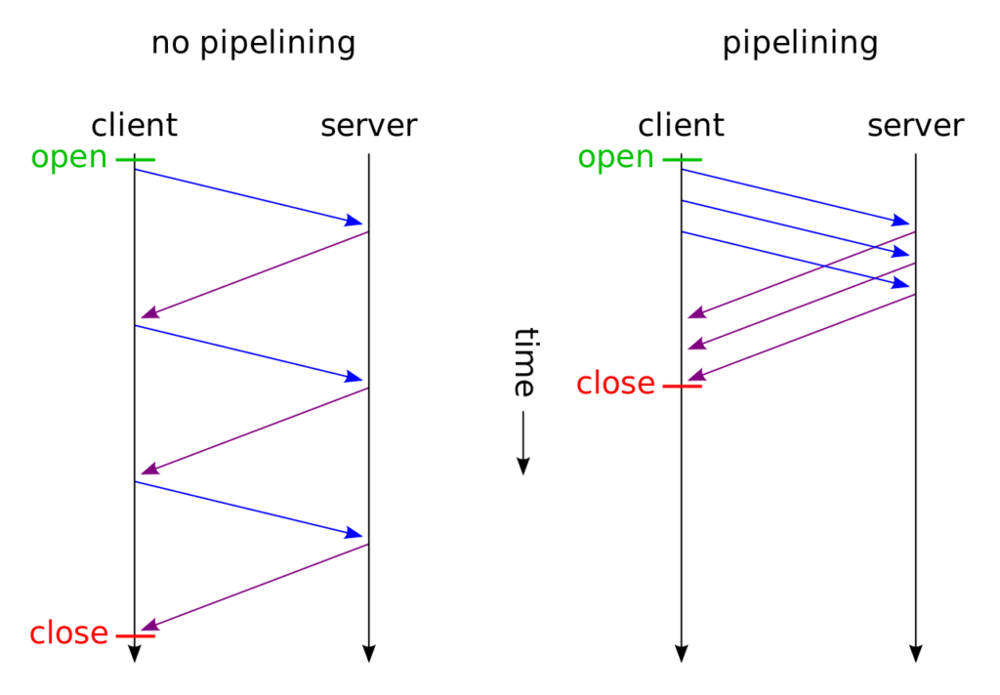

# Tại sao không nên dùng Http1.1 để giao tiếp giữa các service trong hệ thống có tải cao

Để thiết kế một hệ thống tin cậy có thể chịu được tải cao thì chúng ta cần quan tâm rất nhiều yếu tố :
- database : nosql, sql, in-mem database, index, partition,...
- caching
- design service
- load balance
- ...

Thời điểm hiện nay chúng ta sẽ dễ dàng tìm được các bài báo cũng như các bài hướng dẫn, so sánh về các
mục bên trên. Thời điểm hiện tại đa số các hệ thống sẽ được xây dựng trên mô hình **microservice** nhưng 
khi sử dụng mô hình trên thì còn một điều khá quan trọng chúng ta cần phải quan tâm đó là cách giao tiếp
giữa các service với nhau ( **service communicate** ). Khi mới bắt đầu vào lập trình hầu hết các bài báo
cũng như hướng dẫn tôi được đọc thì họ đều sử dụng **http1** để lấy làm ví dụ cho hệ thống của họ. Nhưng 
trong quá trình trải nghiệm trong thực tế tôi thấy việc sử dụng **http1** có rất nhiều hạn chế khi hệ thống
gặp tải cao. Tại bài viết này với kinh nghiệm cá nhân của mình thì mình sẽ chia sẻ cho mọi người biết các
hệ thống có tải cao của mình từng làm sẽ dùng cách thức nào để giao tiếp với nhau. 

Giới thiệu một chút các hệ thống tải cao và yêu cầu độ trễ thấp mình từng làm là :
- Hệ thống **Antispam** của Viettel
- Sàn **Trading** của công ty Nextop.asia

# 1. TCP Socket
Vì tất cả hệ thống của mình đều sử dụng **TCP** nên mình sẽ chỉ chia sẻ về **TCP** tại đây.
**TCP** là một giao thức truyền tin qua mạng có đảm bảo dữ liệu được truyền tải thành công điểu này mọi người đều đã biết.
Hầu hết các giao thức khác đều dựa trên **TCP** và **UDP** nên việc biết về 2 mô hình **socket** này trước là điều cần thiết.

## 1.1. Client
Chúng ta có một ví dụ đơn giản về một **TCP** client đơn giản bằng ngôn ngữ **Java**. Đây là một ví dụ trên mạng
```java
import java.net.*;  
import java.io.*;  
class MyClient{  
public static void main(String args[])throws Exception{  
Socket s=new Socket("localhost",3333);  
DataInputStream din=new DataInputStream(s.getInputStream());  
DataOutputStream dout=new DataOutputStream(s.getOutputStream());  
BufferedReader br=new BufferedReader(new InputStreamReader(System.in));  
  
String str="",str2="";  
while(!str.equals("stop")){  
str=br.readLine();  
dout.writeUTF(str);  
dout.flush();  
str2=din.readUTF();  
System.out.println("Server says: "+str2);  
}  
  
dout.close();  
s.close();  
}}  
```
Để tạo ra một kết nối **TCP** thì chương trình sẽ phải tốn những tài nguyên sau :
- **file descriptor**  (mỗi **TCP connection** đều cần 1 file descriptor) khoảng 4KB.
- **Buffer size** của kết nối TCP.
- Chi phí mạng.
- Một **Thread** đọc dữ liệu từ **server** trả lại.

Chi phí này là khá lớn và nếu quá nhiều kết nối TCP cùng tồn tại thì sẽ gây quá tải cho hệ thống của bạn.

## 1.2. Server
Với server lượng chi phí của chúng ta cũng sẽ mất tương tự như phía client nếu sử dụng mô hình **Blocking IO** (một số **server** nổi tiếng đang sử dụng mô hình này).
Nhưng nếu sử dụng mô hình **Non Blocking IO** thì chi phí sẽ thấp hơn vì không nhất thiết phải tạo luồng mới để đọc dữ liệu của client gửi lên.
Mọi người nếu chưa biết về 2 mô hình **socket** này thì nên tham khảo trên mạng.

Nhưng có một điều lưu ý là số lượng **TCP connection** của một server sẽ có giới hạn.
Theo lý thuyết thì một **TCP connection** sẽ bao gồm (source IP, source port, dest IP, dest port) vậy số lượng connection tối đa một server có thể
có sẽ là 2^48. Vì số connection chỉ phụ thuộc vào :
- số lượng source IP 2^32 và 
- source port 2^16 connection có thể xảy ra.
Nhưng thực tế sẽ dựa vào nhiều yếu tố khác :
- OS : số lượng **file descriptor** tối đa của hệ điều hành có thể mở ra (mỗi **TCP connection** đều cần 1 file descriptor). Trên linux kiểm tra bằng lệnh ** ulimit -a **
- RAM : không tính đến **buffer** của mỗi **socket** thì mỗi **file descriptor** sẽ có dung lượng khoảng 4KB.

Vậy nếu điều kiện nào đến trước thì đó sẽ là giới hạn của server của hệ thống.

# 2. Http1.1


Mọi người không ai còn xa lạ với giao thức này nữa. Tại giao thức này đã cho phép chúng ta khả năng **pipeline** request nhưng khi dùng **pipeline** thì các
**request** và **response** phải được gửi và nhận lần lượt. Nếu điều này bị vi phạm sẽ dẫn đến client không thể biết **response** này là của 
**client** nào. Tiếp đến nếu một **request** không may bị thất lạc thì khiến các request khác trong **pipeline** sẽ không được gửi lên server
điều này sảy ra tình huống **HOL** gây giảm hiện năng. Vì những lý do trên nên hiện tại mình chưa từng dùng được một thư viện nào hỗ trợ mình
chức năng **pipeline** của Http1.1.

## 2.1. Điểm yếu của Http1.1
Như phần trên chúng ta có thể nhận ra điểm yếu của Http1.1 đó chính là chúng ta sẽ không thể tái sử dụng một **Http connection** để gửi request
nếu nó chưa nhận được **response** của server. Trong khi hệ thống cao tải thì chúng ta cần gửi rất nhiều **request** cùng một lúc đến các service
khác nhau điều này bắt buộc chúng ta phải tạo ra rất nhiều **Http connection** và như đã biết việc tạo ra nhiều **Http connection** bên trên sẽ gây
quá tải cho hệ thống của các bạn.

Tất nhiên các thư viện viết **Http1.1 client** đều cho phép bạn tạo connection pool nhưng khi hết connection trong pool một số thư viện sẽ tạo mới (tốn kém tài nguyên ),
một số sẽ cố gắng đợi connection được trả lại trong pool điều này sẽ khiến các request mới sẽ không được gửi gây giảm hiệu năng hệ thống của bạn xuống.

Vậy nên hệ thống bạn mà giao tiếp dựa trên **http1.1** thì sẽ là hệ thống **synchronous**, hệ thống này sẽ không thể đáp ứng được những ứng dụng có tải cao
và yêu cầu độ trễ thấp. 

Các bạn sẽ có thể bị bối rối việc các thư viện **http1.1** cho phép sử dụng các **asynchronous api**? Các thư viện đó thực chất sẽ sử dụng các **Thread** khác để
thực hiện **request** của bạn chứ không sử dụng chỉ **Thread** của bạn nên tốc độ của khi gửi request sẽ tốt hơn. Nhưng đứng dưới góc độ của **Http connection** 
nó vẫn sẽ là **synchronous**.

# 3. Cách thay thế Http1.1
## 3.1. Http2
Câu trả lời của hầu hết mọi người là **Http2** vì nó quá nổi tiếng mà.

Tất nhiên việc nâng cấp lên **Http2** cũng không hề dễ dàng như mọi người nghĩ. Mình đã từng làm một bài về  **Http2 in real project** 
mình cảm thấy các thư viện **Http2 client** hiện tại vẫn chưa hỗ trợ hết tính năng của **Http2** nếu cần thì bạn hơn thì bạn cần viết
một **client** dành cho riêng mình. Với mình thì là tự viết **client** để giao tiếp với **APNS** của Apple.

Mình cũng đã thử config **Http2 server** trên **spring-boot** với **tomcat** và cũng cảm thấy khi config server này bằng **spring-boot** hiện tại 
cũng chưa hỗ trợ hết tính năng của **Http2**.

Nếu bạn chưa biết thì **Http2** sẽ cho cung cấp cho chúng ta giải pháp ghép kênh (**multiplexing**) nghĩa là cho phép chúng ta sử dụng một **http2 connection**
gửi nhiều **request** và **response** nhận về vẫn có thể biết được đó là của **request** nào. Còn việc gửi nhiều thì bản thân **TCP socket** đã giúp bạn gửi nhiều **request**
rồi. Gửi nhiều **request** trên cùng một **connection** không phải là tính năng mới trên **Http2**. Tính năng mới trên **Http2** là gửi nhiều **request** và **response** nhận 
về vẫn có thể biết được đó là của **request** nào ( Điều quan trọng phải nhắc lại 2 lần :)) ).

Vậy tại sao **Http2** có thể làm được điều đó. Nó làm được điều đó vì mỗi request sẽ được đánh **ID** và được biết với tên **Stream ID**. **Server** và **Client** gửi **request**
và **response** phải gửi kèm theo **Stream ID** này để có thể phân biệt với nhau.

Vì bài này không chia sẻ về **Http2** và **Http2** còn rất nhiều thông tin thú vị khác các bạn xem thêm tại bài viết : https://httpwg.org/specs/rfc7540.html#top
 
## 3.2. Đánh ID cho từng request
Trước khi **Http2** ra đời, các công ty công nghệ lơn như **Apple**, **Google** đã sử dụng phương pháp đánh **ID** cho từng request để giúp phân biệt **response** thuộc về
**request** nào. Cũng có thể đây là động lực cho sự ra đời của **Http2**. Cách này giúp chúng ta **tái sử dụng** được các **connection** được tạo ra mà không cần đợi **response**

Cụ thể hơn là mình đã được làm việc với **service** gửi thông báo về các thiết bị **Android** và **IOS** của 2 thanh niên công nghệ trên. Và 2 thanh niên này thì có tải cực
kỳ lớn và do đó họ đều không sử dụng **Http1.1** là công cụ giao tiếp chính cho **client**.

Cụ thể như sau :
- Apple : Gần đây APNS đã dịch chuyển từ **TCP Socket** sang **Http2** giúp cho khách hàng có thể sử dụng một **connection** gửi nhiều thông báo với các máy **IOS**. Vậy trước đây
khi sử dụng **APNS** tại project cũ bọn mình cần phải tạo ra kết nối **TCP Socket** đến **Apple** và mỗi khi push notify đến thiết bị **IOS** thì request mình gửi lên **Apple** sẽ phải
đính kèm một **unique id** trên một connection. Và Apple sẽ trả lại kết quả qua **Tcp Connection** trên và sẽ đính kèm theo **ID** của **request** để mình còn map lại được **request**
với **response**

- Google : **Google** thì cung cấp **Firebase API** dưới dạng **Http1.1** và dạng **XMPP**. Dạng **Http1.1** thì đơn giản dễ hiểu với mọi người nên nếu không có quá nhiều khách hàng sử dụng
dịch vụ và không gửi nhiều **request** để notify thì hầu hết mọi người sẽ chọn giao thức này. Chúng ta sẽ không thể nghi ngờ khả năng của **Google** được nên khi chúng ta cần gửi nhiều
thông báo khác nhau cho nhiều thiết bị khác nhau và sử dụng **Http1.1** mà bị chậm thì chúng ta cần phải xem lại project của mình. Trong trường hợp này thì mọi người nên chuyển sang
giao thức **XMPP** vì giống với **Apple** tại đây **Google** sẽ bắt **client** của mình tạo ra các **ID** khác nhau cho từng **request** gửi lên. Nhưng có một điều là giao thức **XMPP**
không hỗ trợ dạng **Batch** nên nếu bạn cần gửi cho nhiều thiết bị và nội dung giống nhau 100% thì nên quay lại dùng **Http1.1**nhé.

# 4. Mình đã sử dụng phương pháp nào tại các sản phẩm đã làm.
Phương pháp hiện tại mình đang sử dụng cách đánh **ID** cho từng **request** sau đó gửi sang các **Service** thông qua :
- **Non Blocking Socket** (Sử dụng Netty) nếu **share** API cho bên ngoài. Sắp tới nếu có bên nào cần thì bên mình chắc sẽ viết dưới dạng **Http2** server cho hợp thời đại.
- **message queue** đối với giao tiếp nội bộ của hệ thống.

Sau đó **response** sẽ đính kèm **ID** cũng gửi theo các đường này về **client** .
 
Hệ thống của mình giao tiếp giữa các **service** là dạng **asynchronous** điều đó khiến khi cao tải thì hệ thống cũng không tạo thêm các **TCP connection** để giao tiếp.
Điểu đó cũng giúp giảm tài nguyên của hệ thống xuống khá nhiều.

Kết bài tại đây mình muốn khuyên cho mọi người khi xây dựng hệ thống nếu yêu cầu có tải lớn và độ trễ thấp thì nên di chuyển giao tiếp từ **Http1.1** sang các dạng khác theo các công
ty lớn như **Apple**, **Google**. Mặc dù cách này sẽ tốn rất nhiều thời gian gian đoạn đầu nhưng giai đoạn sau khi có nhiều khách hàng mọi thứ sẽ hoạt động trơn tru và không phải
chịu cảnh hệ thống quá tải vì giao tiếp. Các bạn sẽ ít nhất không phải trải qua cảnh **gateway** của mình chỉ làm nhiệm vụ forward cũng sẽ tốn rất nhiều tài nguyên ( RAM, CPU).

Mình biết các thư viện và mô hình **micro service** có sẵn trên mạng có thể vẫn dùng chủ yếu là **Http1.1** nên việc thay đổi mô hình không phải là điều dễ dàng.

Tại các công ty mình đã làm việc thì việc chọn giao tiếp dưới dạng **REST API** dưới dạng **Http1.1** là điều thường xuyên xảy ra và cũng đã trải qua những đắng cay vì **Http1.1**
khi tải cao và số lượng connection nó tạo ra là quá lớn. 

Tất nhiên việc tạo ra một hệ thống chạy tốt cần phải có nhiều yếu tố khác nhau nữa nhưng việc giao tiếp với các **service** là một điều cần quan tâm.

Bài này hoàn toàn là kinh nghiệm cá nhân trong quá trình làm việc rất mong có sự góp ý của mọi người để giúp mình và mọi người nâng cao khả năng lập trình.
