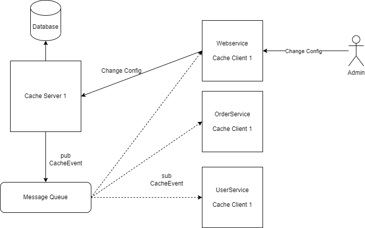
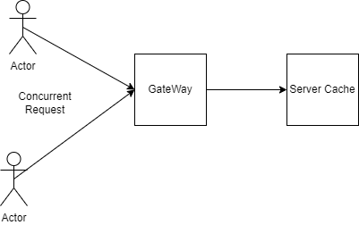

# Distributed cached

**Caching** là một kỹ thuật quen thuộc với tất cả anh em lập trình viên,lợi ích của việc sử 
dụng **caching** để tăng tải hệ thống thì chắc ai cũng biết.

Hiện nay khi xây dụng phần mềm hiện nay thì chúng ta sẽ không **deploy** riêng lẻ một **service**
mà sẽ là **deploy** nhiều service khác nhau và mỗi **service** cũng có thể có các **slave**.

Vậy chúng ta cần xây dựng một phương án hợp lý để xây dựng **caching** giữa các **service**, khi một **service** thay đổi
cache tất cả **service** sẽ được cập nhật nội dung mới này. Sẽ rất dễ dàng tìm được đó là sử dụng một **in-mem database** như : redis, mem cache,...

Trong các phần mềm mình đã tiếp xúc và xây dựng như : **antispam**, **trading**, ... Các hệ thống 
này thường yêu cầu độ trễ thấp cũng như có tải rất cao, vậy nên phương án dùng **in-mem database** không
phải là giải pháp tối ưu cho lắm. 

Mặc dù các **database** này có tốc độ rất cao nhưng nếu mình **query** cũng sẽ rất tốn chi phí về : **connection**,
 **context switching**, mạng. Đặc biệt với **redis** nếu mình không sử dụng thư viện [lettuce](https://lettuce.io/) 
 để giao tiếp **acsync** thì tài nguyên hệ thống bỏ ra sẽ là rất lớn khi tải cao. Tại đây có thể các bạn chưa trải qua cảm giác hệ thống mình
quá phụ thuộc quá nhiều các **in-mem database** đến khi **database** chậm thì khó có thể nào đưa ra được
 cách tối ưu hợp lý, bọn mình đã từng tăng gấp 3 số lượng master của 1 cụm **redis-cluster** từ 3 lên 9 mà tại thời điểm cao 
 tải vẫn không phục vụ được. Vì **redis-cluster** sẽ lưu dữ liệu dữa trên các **16384 slot** nếu tăng lên 9 thì số lượng
 **slot** sẽ được chia đều cho các **master** theo lý thuyết thì nó có thể mạnh như 9 **server redis**. Bài này mình không
 chia sẻ nhiều về **redis** nhưng nếu các bạn quan tâm thì mình sẽ ra bài này.

Hiện tại hệ thống của công ty mình đang sử dụng **distributed cache** mà không phụ thuộc vào **im-mem database** 
tất cả dữ liệu của được **cache** trên **RAM** để tăng hiệu năng tổng thể của toàn bộ hệ thống. Tất nhiên hệ thống
**distributed cache** này sẽ tự động **update** khi có một **service** thay đổi nội dung của **cache** (thường sẽ là do
admin thay đổi dữ liệu cache để turning hệ thống hoặc các job định kỳ)

Tại bài này mình sẽ chia sẽ cho các bạn kiến thức để xây dựng một **distributed cache** để nếu một ngày **in-mem database**
của bạn không hoạt động như ý muốn thì coi đây là một giải pháp.

## system architecture

Sau đây là cách mình thiết kế một **Distributed cache**



Hệ thống sẽ gồm các thành phần chính sau:
+ CacheServer
+ Database, Msg queue
+ CacheClient

## Database, Msg queue
Có thể một số bạn sẽ chưa biết ý nghĩa của **msg queue** trong hệ thống là gì nên tại đây mình xin sẽ giải thích đơn giản 
một cách dùng của **msg queue** trong thực tế.

Để hai **server** có thể giao tiếp được với nhau thì rất đơn giản chúng ta cần tạo một kết nối **tcp** giữa 2 **service**
sau đó truyền dữ liệu qua kênh này. Tương tự khi bạn muốn giao tiếp với rất nhiều **service** khác nhau một lúc thì bạn 
sẽ phải tạo tất cả kết nối đến các **service** này, trong hệ thống **micro-service** thì việc này khá phức tạp.

Vì nhu cầu giao tiếp từ một **service** đến các **service** còn lại là rất nhiều nên các lập trình viên thiên tài khác đã 
nghĩ ra mô hình sử dụng **msg queue** và cơ chế giao tiếp sẽ là **pub-sub**. Vì vậy chúng ta chỉ cần tạo một kết nối đến
**msg queue** gửi **event** đến và **msg queue** sẽ giúp chúng ta gửi đến các **service** khác. Một số trong các **msg queue** 
nổi tiếng hay được sử dụng là **kafka**,**activemq**,**redis**. Tại bài này mình sẽ sử dụng **kafka** code **demo** cho việc
gửi **cache server** gửi các thay đổi cho các **client**.

## Building system
Khi xây dụng hệ thống **cache** thì chúng ta cần quan tâm đến:
- Cách giao tiếp với trong hệ thống
- Server quản lý bảng **cache** trong **database**.


## Server quản lý cache
Việc xây dụng một **server** đơn giản quản lý một số bảng trong **database** thì mình sẽ không nhắc đến vì nó là việc hàng 
ngày của các lập trình viên rồi. Nhưng khi quản lý **cache** thì bạn cần quan tâm đến trường hợp sau.



Đây là trường hợp mà có 2 **request** cùng sửa một **cache** đến cùng một thời điểm. Bạn cần chú ý có phương pháp để từ chối một
**request**. Cách đơn giản nhất để giải quyết vấn đề này thì hãy dùng phương pháp **optimistic locking**. 

## Giao tiếp
Cách giao tiếp giữa **server** và **client** ở đây có thể là trái tim của cả hệ thống, bao gồm:
- **client** gửi **request** thay đổi nội dung **cache** tới **server**
- **server** gửi thông báo thay đổi **cache** đến các **client** thông qua **msg queue**.

### Giao tiếp thay đổi nội dung cache
Có rất nhiều cách để giao tiếp giữa **client** và **server** có thể dễ dàng tìm thấy như sau:
- REST
- RPC : REST, Grpc, Thrift,...
- Tự viết một giao thức thông qua **socket**. Vấn đề này mình cũng có code demo đơn giản tại một bài **blog** rồi.

Với các **framework** sẵn có hiện nay việc này sẽ được các lập trình viên làm trong 30 giây.

Về giao tiếp hiệu quả thì sẽ tùy vào hệ thống để chọn một cách đơn giản và tiết kiệm chi phí nhất. Đối với các hệ thống tải cao
thì mình đã bài nói về cách giao tiếp sao cho tiết kiệm tài nguyên trong các loại hệ thống này.

### Server gửi thông báo cho client qua msg queue
Từ đầu bài viết đến giờ chủ yếu là kiến thức và kỹ thuật các anh em lập trình viên **backend** làm hàng ngày. Đó là chỉ là phần 
mở bài, đây mới là phần mình muốn chia sẻ một chút khác khác với anh em. 

Vấn đề cần giải quyết duy nhất ở đây là thiết kế một **Event** để từ **server** có thể gửi đến các **client** để các **client** 
có đầy đủ thông tin để **update** cache. 

Mình xin chia sẻ cách thiết kế của mình để anh em có thể hiểu và thay đổi nếu cần cho phù hợp với hệ thống. Mình sử dụng ngôn 
ngữ **Java** là ngôn ngữ chính nên mọi người chịu khó đọc **Java** nhé.

Trước khi vào thiết kế chi tiết kế **msg** cũng như các phần khác thì mình xin giới thiệu một **package** quan trọng của **Java**
đó là **Java Reflection** nếu không có **package** này thì mình không thể xây dựng được **distributed cache**.

#### Java Reflection
Trình bày các phần mình sẽ dùng

#### Chi tiết
Biểu đồ flow
Serialize
Send
DeSerialize


```java
import blog.serialize.base.*;

import java.util.Arrays;

public class RemoteEvent implements DMarshallable {
    private String topic; // topic in msg queue
    private String type;  // method name : set, del, add
    private int serverId; // id của server
    private byte[] args;  // nội dung của cache
   

    public RemoteEvent() {
    }

    public RemoteEvent(String topic, String type, int busId, byte[] args) {
        this.topic = topic;
        this.type = type;
        this.busId = busId;
        this.args = args;
    }

    //getter, setter and some method to serialize data

}
```
Giải thích các biến :
- topic : Dùng để bắn vào đúng topic và khi gửi, nhận sẽ sử dụng đúng loại serialize/deserialize để gửi nhận gói tin.
- type : Dùng để đánh dấu method client cần gọi khi nhận được msg
- serverId : Đánh dấu **server** gửi msg
- args : parameter của hàm được gọi (biến type). khi nhận được **client** cần deserialize thành object[] sau đó gửi thành


