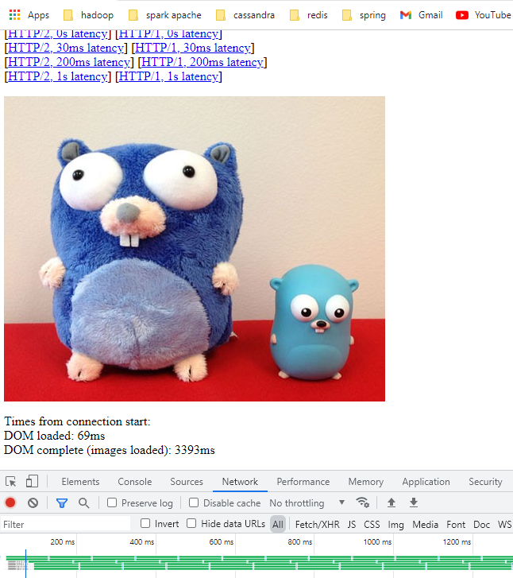

# Note for http2
Http2 là một giao thức truyền thông tin qua mạng một cách hiệu quả và tiết kiệm tài nguyên. Mặc dù đã được giới thiệu 
từ lâu nhưng không ít lập trình viên backend còn cảm thấy mới với loại **protocol** này. Sau khi tìm hiểu và áp dụng vào
dự án thực tế mình muốn chia sẻ những kiến thức của mình về giao thức này với mọi người hy vọng giúp ích được cho mọi người
trong dự án của mọi người.

Dự án gần đây mình làm là viết **client** giao tiếp với [**notify server**](https://developer.apple.com/library/archive/documentation/NetworkingInternet/Conceptual/RemoteNotificationsPG/APNSOverview.html#//apple_ref/doc/uid/TP40008194-CH8-SW1)
 của apple. **Apple** đã dịch chuyển từ giao tiếp thông qua từ **socket** sang **Http2 server**. Trong khi làm việc mình cũng tìm được một số thư
 viện đã được viết sẵn để giao tiếp với service mới này của apple như :
 - [java-apns](https://github.com/notnoop/java-apns)
 - [pushy](https://github.com/jchambers/pushy)

Tuy nhiên để sử dụng thêm 1 thư viện mới vào product đang được chạy cũng có khá nhiều rủi ro vì cũng chưa có đủ thời gian để làm quen với chúng xem điểm mạnh,
điểm yếu của thư viện. Tiếp đến việc ghép vào các **interface** có sẵn của project cũng khá khó. Nên mình tiếp tục tìm hiểu được một số thư viện có thể **Http2 client**
viết sẵn trong **java** như :
- [okhttp3](https://square.github.io/okhttp/)
- [netty](https://netty.io/)

Trong bài này mình sẽ chia sẻ rõ hơn về 2 thư viện **netty** và **okhttp3** này
 
Ứng dụng nổi tiếng nhất áp dụng **Http2** mà mình từng biết là **Grpc**. Với **Java** thì **Grpc** sử dụng **netty** để xây dụng tầng **transport** của mình.
Điều này khiến mình có thêm tài liệu là code của **Grpc** để tham khảo xây dụng **http2 client** để thao tác với Apple. 

Bài blog này sẽ có code demoe của các phần sau:
- Simple http2 server
- okhttp3 client 
- Simple netty http2 client

## Simple http2 server
Demo về tốc độ của http2 server so với http1.1 trên mạng là rất nhiều :
- http://www.http2demo.io/
- https://http2.akamai.com/demo

Khi các bạn vào trình 2 web site trên sẽ thấy được tốc độ load tài nguyên thực sự là chênh lệch rất nhiều nếu sử dụng http2.

Vì tò mò nên tôi cũng tự xây dựng cho mình 1 http2 server để test tốc độ cũng như để làm server test cho **client** của mình.
Tôi sử dụng Spring-boot để tự viết **Http2 server** vì với **Spring boot** bạn sẽ làm được điều này rất nhanh chỉ cần thay đổi trong file config là bạn đã có
1 **Http2 server** sử dụng **spring boot** rồi. Code demo tại package `http2.server`. Sẽ được đính kèm ở cuối bài viết này.

Tại code demo này tôi sẽ cho trình duyệt load 180 cái ảnh để so sánh tốc độ. Trước khi load ảnh mình sẽ cho luồng đó dừng lại 100 ms
```
    @GetMapping(value = "/gophertiles_files/{name}", produces = MediaType.IMAGE_JPEG_VALUE)
    public ResponseEntity<ByteArrayResource> getImage(@PathVariable String name) throws IOException, InterruptedException {
        Thread.sleep(100);
        final ByteArrayResource inputStream = new ByteArrayResource(Files.readAllBytes(Paths.get(
                "image/" + name
        )));
        return ResponseEntity
                .status(HttpStatus.OK)
                .contentLength(inputStream.contentLength())
                .body(inputStream);

    }
```
Kết quả của http2 


Kết quả của http1.1



Trình duyệt của bạn sẽ chỉ dùng 1 connection duy nhất để load dữ liệu từ **http2 server** thay vì 6 connection chạy song song với **http1.1 server**.
Bạn có thể check được điều này bằng tab network trong ảnh. Đây là kỹ thuật ghép kênh quan trọng đưa tốc độ load dữ liệu của http2 nhanh hơn nhiều so với http1.1.
Mở ít kết nối hơn cũng đồng nghĩa với việc tiết được nhiều tài nguyên hơn cho cả phía client và server. 

## Http2 client
Sau khi có một server http2 thì việc tiếp theo là xây dụng các client để giao tiếp với http2 server trên.

### Netty Http2 client
Tại code example của [netty](https://github.com/netty/netty/tree/4.0/example/src/main/java/io/netty/example) cũng có demo về việc xây dựng một **http2 client** đơn giản 
với netty. Tại demo này của mình cũng sẽ sử dụng code đó và thay đổi 1 chút để giải thích một số **config** khá quan trọng để xây dựng **http2 client**.

Tài liệu chi tiết về **http2** các bạn tham khảo tại link sau : https://httpwg.org/specs/rfc7540.html#top

Tại link đó sẽ mô tả chi tiết cho chúng ta về : **Stream**, **Frame**, **Error**, **config**, ... Nếu các bạn muốn tự mình xây dựng 1 client mà không dựa vào **netty** thì có
thể tham khảo nhé. Mình chỉ đọc để biết code với **netty** như thế nào thôi. Code demo tại `package http2.client.netty;`.

Tại đây mình sẽ giải thích 1 số thứ quan trong khi sử dụng netty làm client ứng với tài liệu viết tại link `https://httpwg.org/specs/rfc7540.html#top`
- **Stream** Theo tài liệu của HTTP2 thì một connection sẽ sử dụng **Stream** để giao tiếp giữa **client-server**. Điều này giúp **Http2** thực hiện ghép kênh trên cùng 1 kết
nối **TCP** nhưng lại gửi được nhiều **request**. Mỗi **Stream** được định nghĩa bởi 1 **ID** vì vậy muốn biết được **response** này là của **request** nào thì mình cần phải
biết được là **Stream ID** khi gửi request là gì và lưu lại. Theo tài liệu thì nếu là **Client** stream Id là một số lẻ bắt đầu từ 1,3,5,7,... Và nếu là **Server** thì sẽ bắt đầu
từ 0,2,4,6,8,... 

Khi bắt đầu thực hiện kết nối giữa client với server thì Client và Server phải gửi **setting** của mình cho nhau sau đó mới bắt đầu gửi request được. Điều đó giải thích cho việc
trong code client demo của **netty** cũng như demo của mình để bắt đầu với **Stream ID** là 3.
Tại class Http2ClientInitializer
``` 
    private int streamId =3;

    public int getCurrentStreamId(){
        int current =streamId;
        streamId +=2;
        return current;

    }
```
- **Frame** Http2 sẽ gửi nhận dữ liệu thông qua các **Frame**, **Header Frame** và **Data Frame**, Netty cũng cung cấp cho chúng ta api đọc dữ liệu của các **Frame** này. Tại bản demo
này để đơn giản mình không đọc dữ liệu thông qua **Frame** mà nhờ **netty** làm giúp điều này. Nếu được ủng hộ mình sẽ có bài viết implement theo **Frame** này.

- **SETTINGS_MAX_CONCURRENT_STREAMS** Như đã trình bày ở trên thì khi thực hiện kết nối client, server sẽ gửi **setting** của mình cho nhau. 1 Trong những config quan trọng nhất cần quan
tâm khi mình là client là **SETTINGS_MAX_CONCURRENT_STREAMS**. **SETTINGS_MAX_CONCURRENT_STREAMS** số này có ý nghĩa là server sẽ chấp nhận số lượng **Stream** đồng thời tối đa là bằng
**SETTINGS_MAX_CONCURRENT_STREAMS**, client **không được** gửi quá lượng lượng **Stream** lên server không thì server sẽ đóng lại **Stream** và **Client** sẽ không nhận được kết quả.
Với server demo sử dụng spring boot của mình số **SETTINGS_MAX_CONCURRENT_STREAMS** sẽ là 100 và được gửi trong **HEADER** của **HTTP2Setting**. Với server của **Apple** con số này
sẽ là 1000. Nếu bạn có như cầu gửi hơn 1000 request đến **Apple** 1 lúc thì hãy tạo thêm 1 **connection** mới nhé.

- Với code demo trên thì bạn cũng nhận được kết quả là gọi 180 lần lên server với 1 connection thì kết quả sẽ là hơn 1 giây. Tất nhiên đây là 1 demo đơn giản nên nó sẽ chậm hơn trình 
duyệt 1 chút.

### OKHttp3 client
Tiếp theo chúng ta sẽ sử dụng okhttp3 làm client. Vì code này ngắn nên bạn có thể xem Code demo bên dưới 
```java
package http2.client.okhttp;

import okhttp3.*;
import org.jetbrains.annotations.NotNull;

import javax.net.ssl.SSLContext;
import javax.net.ssl.TrustManager;
import javax.net.ssl.TrustManagerFactory;
import javax.net.ssl.X509TrustManager;
import java.io.IOException;
import java.security.cert.CertificateException;
import java.security.cert.X509Certificate;
import java.util.Arrays;
import java.util.concurrent.CountDownLatch;
import java.util.concurrent.TimeUnit;

public class OkhttpClient {
    public static void main(String[] args) throws Exception {
        OkHttpClient client = getUnsafeOkHttpClient();
        client.dispatcher().setMaxRequestsPerHost(1);
        Request request = new Request.Builder()
                .url("https://localhost:8082/test")
                .build();

        Response r1 = client.newCall(request).execute();
        System.out.println(r1.protocol());
        client.dispatcher().setMaxRequestsPerHost(100);
        CountDownLatch countDownLatch = new CountDownLatch(180);
        long startTime = System.currentTimeMillis();
        for (int i = 0; i < 180; i++) {
            client.newCall(request).enqueue(new Callback() {
                @Override
                public void onResponse(@NotNull Call call, @NotNull Response response) throws IOException {
                    response.close();
                    countDownLatch.countDown();
                }

                @Override
                public void onFailure(@NotNull Call call, @NotNull IOException e) {

                }
            });
        }
        countDownLatch.await();
        long time = System.currentTimeMillis() - startTime;
        System.out.println("time run " + time);
    }

    private static OkHttpClient getUnsafeOkHttpClient() {
        try {
            ConnectionPool connectionPool = new ConnectionPool(1, 3000, TimeUnit.SECONDS);

            // Install the all-trusting trust manager
            SSLContext sslContext = SSLContext.getInstance("SSL");
            TrustManagerFactory trustManagerFactory = TrustManagerFactory.getInstance(TrustManagerFactory.getDefaultAlgorithm());

            X509TrustManager manager = new X509TrustManager() {
                @Override
                public void checkClientTrusted(X509Certificate[] chain, String authType) throws CertificateException {

                }

                @Override
                public void checkServerTrusted(X509Certificate[] chain, String authType) throws CertificateException {

                }

                @Override
                public X509Certificate[] getAcceptedIssuers() {
                    return new X509Certificate[0];
                }
            };

            TrustManager[] managers = new TrustManager[1];
            managers[0] = manager;

            sslContext.init(null, managers, null);


            OkHttpClient okHttpClient = new OkHttpClient.Builder()
                    .followRedirects(false)
                    .sslSocketFactory(sslContext.getSocketFactory(), manager)
                    .protocols(Arrays.asList(Protocol.HTTP_2, Protocol.HTTP_1_1))
                    .retryOnConnectionFailure(true)
                    .connectionPool(connectionPool)
                    .build();

            return okHttpClient;
        } catch (Exception e) {
            throw new RuntimeException(e);
        }
    }
}


```

**OkHttpClient** có một nhược điểm là sẽ mở rất nhiều connection dựa theo số `MaxRequestsPerHost` .Nếu các bạn không set giá trị
**MaxRequestsPerHost** thì mặc định sẽ là 6 giống như trên trình duyệt. Sau khi gửi **request** đến server và biết được server lòa **http2 server** thì
**OkhttpClient** sẽ đóng hết tất cả kết nối lại và chỉ sử dụng 1 kết nối dành cho mục đích truyền tải dữ liệu với server. Đó là lý do tại sao mình lại
phải gửi 1 **request** trước mục đích để khởi động hệ thống sau đó mới thiết lập lại số  **MaxRequestsPerHost**. Tiếp theo nữa là **MaxRequestsPerHost** cũng tương ứng với
 số luồng được mở ra trong **java** để gửi nhận dữ liệu điều này cũng khá tốn thời gian. Và tại sao mình lại config số **MaxRequestsPerHost** là 100 thì đã được giải thích tại mục **netty**.

Khi sử dụng **OkHttpClient** mình hoàn toàn không lấy được **setting** của server để **setting** lại số **MaxRequestsPerHost** sao cho tối ưu nhất. Tiếp đến
việc mở quá nhiều kết nối **TCP** tại thời điểm đầu tiên cũng là một nhược điểm của **OKHttpClient**. Việc sử dụng **OKHttpClient** sẽ làm code ngắn gọn hơn rất nhiều
nhưng không mang lại hiệu quả tối ưu nhất khi sử dụng với product của mình. Việc disconnect và connect lại của **OKHttpClent** khiến mình không làm chủ được việc thiết
lập config **setMaxRequestsPerHost** cho tối ưu.

Khi làm và tìm hiểu về **OkHttpClient** mình có đọc được 1 **issue** khá hot của nó tại **link** : https://github.com/square/okhttp/issues/3442

Tại **issue** này mọi người có nói đến việc **MaxRequestsPerHost** này. Trong có có người bình luận là
` I am sending warm up request and setting setMaxRequestsPerHost to 50. then when tried downloading images, Http/2 seems to be much slower than Http1.1`
và chưa thấy ai giải thích việc này.

Mình xin giải thích việc này như sau để nếu như các bạn sử dụng **OkHttpClient** thì sẽ có thể tham khảo. Khi mình đọc code của **OkHttpClient** mình phát hiện ra
số MaxRequestsPerHost này nếu bạn sử dụng **HTTP1.1** thì sẽ tương ứng với mở 50 **connection** khác nhau đến server điều này hiển nhiên khiến bạn có thể tải được
50 ảnh cùng 1 lúc. Nhưng sao bạn set số MaxRequestsPerHost là 50 với **Http2** lại có tốc độ thấp hơn khi so với **Http1.1** vì theo lý thuyết nó sẽ gửi 50 request lên
server 1 lúc. Điểu này lại ứng với **server** bạn gọi lên, mỗi server sẽ có các cách implement khác nhau để xử lý số lượng **Stream** bạn gửi lên. Mặc dù server trả lại
cho bạn là có thể nhận > 100 (SETTINGS_MAX_CONCURRENT_STREAMS thường lớn hơn 100) **request** 1 lúc nhưng tại bản thân của nó sẽ chỉ xử lý 1 lượng **Stream** nhỏ hơn số
này. Ví dụ với **Http2 server** demo vì mình dùng tomcat thì nó chỉ xử lý cùng 1 lúc là 20 **Stream** mặc dù nhận được 100 **Stream**. Config đó là
**maxConcurrentStreamExecution** tham khảo tại tài liệu của [tomcat](https://tomcat.apache.org/tomcat-9.0-doc/config/http2.html) mặc định số này là 20. 

Vì các lý do trên bạn sẽ thấy tốc độ của  **HTTP1.1**  khi MaxRequestsPerHost là 50 nhanh hơn **Http2** nếu sử dụng **Okhttp3Client**. Nhưng trên thực tế sử dụng 
bạn không bao giở mở nhiều **connection** như thế vì nó tốn tài nguyên và cũng có thể bị server từ chối mở kết nối. 

## Khi nào nên sử dụng HTTP2
Với sự hỗ trợ mạnh mẽ của các **server** hiện nay thì mình nghĩ việc chuyển đổi từ **HTTP1.1** sang **HTTP2** là việc cần thiết và nên làm để tăng trải nghiệm khách hàng của bạn.
Như bạn biết trình duyệt của bạn chỉ mở 6 connection vậy nên tốc độ không thể nào so sánh được với **HTTP2** nên việc trải nghiệm dịch vụ của bạn sẽ bị tốt hơn nhiều khi sử dụng
**HTTP2**.

Nếu bạn muốn truyền tải thông tin giữa các **server** nếu không cần cấu hình quá đặc biệt thì hãy thử sử dụng **Grpc** nó sẽ tiết kiệm rất nhiều tài nguyên và thời gian cho bạn. 
Mặc dù bạn có sử dụng **Grpc** thì cũng nên tự xây cho mình 1 **Http2 server** để học và tìm hiểu nó sâu hơn và cũng giúp bạn config **Grpc** một cách tối ưu nhất. Tất nhiên không phải
cách tự xây dụng là sử dụng **Tomcat** hay **Jetty** nhé vì nó xây hết rồi lấy gì mà học hỏi nữa.

Nếu bài toán của bạn là xây dụng client giao tiếp với **Apple** thì mình khuyên bạn nên tự xây dụng dụa trên **netty** hoặc sử dụng **pussy** thay vì dùng **okhttp3** mặc dù dùng **okhttp3**
là rất dễ nhưng nó sẽ không mang lại cho bạn 1 kết quả tốt nhất được.