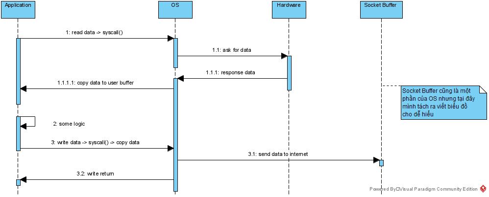
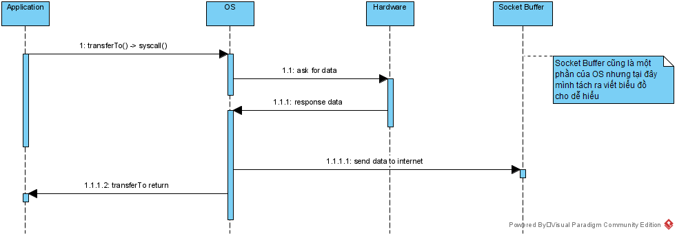
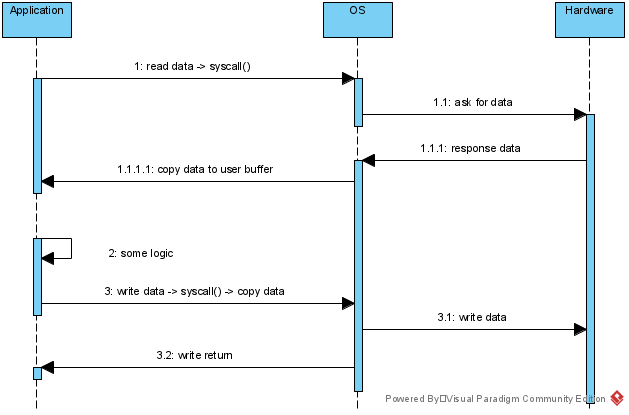
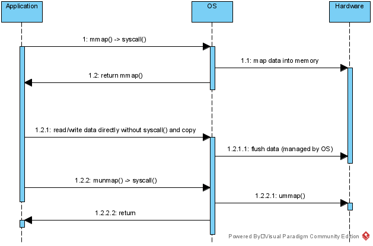
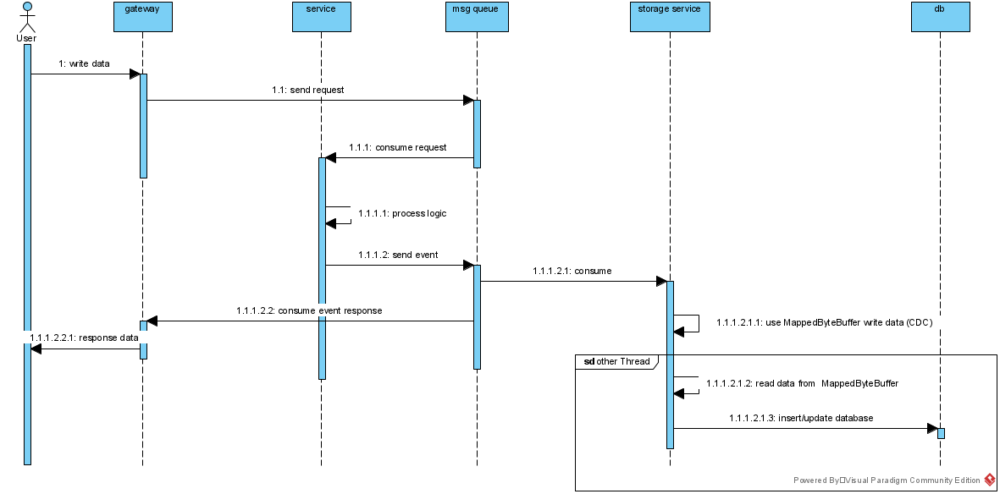

# Off-Heap Java
Java là một ngôn ngữ dễ học mang lại hiệu năng đủ tốt dành cho hầu hết các sản phẩm hiện nay.
Chắc hẳn mọi người biết rằng để xây dựng một hệ thống có thời gian phản hồi trong khoảng 
vài milliseconds thì việc **caching** là rất quan trọng. Việc của chúng ta sẽ phải làm là tăng tỉ lệ
**cache hit** và cách đơn giản nhất là **cache** càng nhiều dữ liệu trên **memory** một vài ứng dụng 
sẽ cần **cache** tất cả lên **memory** mà không sử dụng thêm một **memory database** nào khác.

Một trong các hạn chế của **Java** khi xây dựng hệ thống có tải cao và độ trễ thấp đó là **garbage collection (gc)**.
Mặc dù qua các phiên bản khác nhau của **Java** hệ thống này ngày càng được cải tiến với các 
thuật toán **gc** thông minh hơn giúp giảm thời gian **stop the world** đi nhưng hiện tại với phiên bản **Java 11**
thì thời gian **stop the world** vẫn chưa bằng **0**. Dữ liệu trên **heap** càng nhiều thì sẽ ảnh hưởng tiêu cực đến
các thuật toán **gc** của **Java**. Nếu các bạn muốn đọc thêm về **turning gc** trong **Java**, chọn
thuật toán **gc** nào phù hợp với ứng dụng của mình thì click [Garbage Collection Tuning Guide](https://docs.oracle.com/en/java/javase/11/gctuning/garbage-first-g1-garbage-collector1.html#GUID-0394E76A-1A8F-425E-A0D0-B48A3DC82B42)
đây là tài liệu của **oracle** viết giúp **turning gc**.

Tại bài viết hôm nay mình muốn giới thiệu cho mọi người một kỹ thuật khác trong **Java** có thể dùng để **caching** dữ
liệu mà không làm nặng tải cho các thuật toán **gc** giúp giảm thiểu thời gian **stop the world**. Như đã trình bày bên
trên càng nhiều dữ liệu trên **heap** thì càng làm tăng tải cho các thuật toán **gc**. Vậy cách **cache** dữ liệu mà không
ảnh hưởng đến **gc** sẽ là chúng ta sẽ **cache** một số dữ liệu tại **off-heap** vùng bộ nhớ này sẽ không chịu tác động của
**gc** nên sẽ giảm tải cho thuật toán **gc**.

Bộ nhớ **Off-Heap** trong **Java** là một khái niệm không mới mặc dù nó đã tồn tại rất lâu nhưng hiện tại mình
chỉ sử dụng nó được khoảng gần 1 năm. Tại bài viết này mình sẽ chia sẻ về **off heap** , **zero copy** và các**ứng dụng**
thực tế mình đã làm.

## Sự khác biệt của Off-Heap
Bộ nhớ on-heap trong **Java** đã quá quen thuộc với mọi người. Mọi lập trình viên **Java** đều sử dụng nó hằng
ngày để cấp phát và lưu các đối tượng trong chương trình.

Bộ nhớ **off-heap** sẽ sử dụng **memory** trực tiếp của hệ điều hành nên sẽ không chịu tác động của **gc** trên 
**Java** chúng ta chỉ cấp phát một **object** nhỏ trong **heap** để làm việc với bộ nhớ **off-heap** nên sẽ không
ảnh hưởng đến **gc**.

Vì đây là bộ nhớ của **OS** nên chúng ta chỉ lưu được dữ liệu dưới dạng **binary sequence**. Mọi **object** muốn được
lưu trong **off heap** sẽ phải **serialize** thành các **byte array** và khi muốn truy xuất đối tượng trong **offheap**
thì sẽ cần bước **deserialize** từ **byte array** sang **object**. 

Để sử dụng được bộ nhó **off-heap** trong **Java** cung cấp cho chúng ta class : 
- **DirectByteBuffer** và
- **MappedByteBuffer**.

Hai **class** không những giúp chúng ta xây dựng **caching** trên **off-heap** mà còn có thể tăng hiệu năng của chương trình
trong một số trường hợp nhất định.

## Caching trên Off-heap

Các thách thức khi **implement** **offheap caching**.

|                      | On-Heap                                                                                                             | OffHeap                                                                                          |
|----------------------|---------------------------------------------------------------------------------------------------------------------|--------------------------------------------------------------------------------------------------|
| Cấu trúc dữ liệu     | Implement Hashtable bằng array. Array cho phép ramdom accesss vào object                                            | Implement Hashtable bằng DirectByteBuffer. DirectByteBuffer cho phép access đến offset của bytes |
| Trùng mã **Hash**    | Implement **B-Tree** hoặc **LinkedList** tùy phiên bản của **Java**                                                 | Implement **B-Tree** hay **LinkedList** trên **OffHeap** là rất khó khăn                         |
| **resize** HashTable | Tạo ra **array** mới có size lớn hơn (thường là gấp 2) và tính toán lại hết các mã **hash** và **slot** lưu dữ liệu | Việc tạo mới **DirectByteBuffer** với size gấp đôi là rất tốn kém chi phí.                       |

Chúng ta có thể lựa chọn giải pháp kết hợp giữa **on-heap** và **off-heap** bằng cách sẽ lưu **offset** của một **object** trên **on heap**.
Sau khi lấy được **offset** của **object** rồi thì sẽ dùng các **api** có sãn để **seek** đến **offset** và lấy dữ liệu ra.

Vì có quá nhiều bài toán cần phải giải quyết khi **implement off-heap cache** nên hiện tại mình chưa **code demo** cho mọi người về **offheap cache** được. 

Nhưng trong các **project** **trading** của bên mình (caching tất cả lệnh đang được mở của khách hàng) đã làm đều sử dụng thư viện [MapDB](https://github.com/jankotek/mapdb). 
Đây là một thư viện rất mạnh đang được hơn **4.5K** sao trên **github**. Mình đã đọc qua **source code** của thư viện này thì thấy
tác giả đã cài đặt **off-heap cache** lưu cả phần **offset** và **data** trên  **DirectByteBuffer**. Thuật toán của anh ta rất tuyệt vời
mang lại tốc độ đọc/ghi ngang với các **concurrent collection** của **Java**.

Khi đọc/ghi dữ liệu từ **off-heap** thì chúng ta cần quan tâm một điều nữa là việc **serialize** dữ liệu. Khi có thuật toán đủ tốt dành cho
**caching** data rồi thì **bottleneck** của hệ thống chính là phần **serialize** này. Khi sử dụng **Java** thì mọi người  nên tránh sử dụng
**serialize** có sẵn của nó mà nên dùng một số thư viện như : **kryo**,**proto**,... Hoặc tự xây dựng một bộ **serialize** riêng, tham khảo 
bài viết ngắn gọn của mình về [Serialize](https://demtv.hashnode.dev/how-to-serialize-data-in-java-like-protobuf), code trong **blog** đã được
mình sửa lại rất nhiều và **commit** trên [github](https://github.com/trandem/blog/tree/main/common/src/main/java/blog/serialize).

## Sử dụng DirectByteBuffer tối ưu đọc dữ liệu từ socket
Theo hiểu biết của mình hiện tại có 2 mô hình **socket server** :
- Blocking IO socket. Một **Thread** sẽ đọc dữ liệu từ một **connection**
- Non Blocking IO socket. Một **Thread** đọc dữ liệu từ nhiều **connection**
 
Tại đây mình sẽ nói đôi chút về **Non Blocking IO socket** với **DirectByteBuffer**. Theo các tài liệu viết về mô hình **NonBlockingIO** này
dữ liệu sẽ đọc từ **channel** vào **bytebuffer**. **DirectByteBuffer** được tối ưu cho việc đọc ghi này. Vì **DirectByteBuffer** dùng **memory**
của hệ điều hành chứ không dùng **heap** của **Java**. Và vẫn như trên **DirectByteBuffer** không làm tăng tải cho **gc**.

Khi bạn sử dụng **Heap Buffer** khi ghi dữ liệu của **socket** thì sẽ làm các bước sau:
1. Tạo direct bytebuffer tạm
2. Ghi dữ liệu từ **Heap Buffer** vào **direct buffer** tạm
3. Thực hiện các quá trình **socket I/O** khác bằng **buffer** tạm 

Việc tạo mới **DirectByteBuffer** là rất tốn kém nên nếu sử dụng **DirectByteBuffer** thì hãy nên tạo và tái sử dụng không nên tạo mới.

Công việc hiện tại của mình mỗi khi code **socket** thì sẽ sủ dụng **netty** và **netty** cũng sử dụng **DirectByteBuffer**. 

## Sử dụng MappedByteBuffer

### Zero Copy
Một ứng dụng rất nổi tiếng đó là **Kafka** nó sử dụng cơ chế **zero copy** để khiến dữ liệu từ **server** chuyển về phía **consumer** là nhanh nhất.
Để an toàn **Kafka** persist tất cả **message** của **producer** xuống **file** của **server** và sẽ chuyển dữ liệu từ **file** này đến phía của **consumer**.

Mặc dù liên quan rất ít đến nội dung bài blog này nhưng mình vẫn xin phép giải thích một chút về **zero copy** của **Kafka**.

Nếu không sử dụng kỹ thuật **zero copy** thì **logic** khi **code** sẽ là như sau.

Chương trình của chúng ta sử dụng rất nhiều **API** của hệ điều hành, nhất là khi thao tác với các hệ thống **File** hoặc thao tác với
**socket**. Vậy nên khi muốn đọc **File** hay muốn gửi nhận dữ liệu thì chúng ta đều phải **switching context** để sử dụng **API** của **OS**

Có một số điểm cần lưu ý tại hình trên:
- Chúng ta có 4 lần **switching context**: 2 lần gọi **syscall()** từ **Application**, 2 lần **OS** trả lại kết quả và cho **Application** chạy tiếp.
- Có một lần **copy data** từ **OS** sang **Application**, một lần **copy data** từ **Application** sang **OS**.

Bốn lần **switching context** và hai lần **copy data** có thể gây chậm cho hệ thống **Kafka**. Với hầu hết các ứng dụng thì phần code **logic** rất
phức tạp nên ta không thể tránh được 4 lần **switching context** và 2 lần **copy data** được, nhưng với các kỹ sư **code Kafka** thì họ có thể xử lý được.

Sau khi sử dụng kỹ thuật **zero copy** thì sẽ được như sau.

Với sự **support** của **OS** thì các kỹ sư của **Kafka** đã sử dụng **API** **transferTo()** để gửi thẳng nội dung từ **FileChannel** sang **SocketChannel**
mà không cần **copy** lên **Application** và cũng giảm tải được số lần **switching context**. Tất nhiên để làm được điều này thì các kỹ sư
của **Kafka** phải có cách thiết kêt **File** đủ tốt để biết khi gửi sẽ gửi từ **byte** nào đến **byte** nào để dưới **client** có thể hiểu và **deserialize** được

### Đọc ghi File
Mặc dù **Zero Copy** mang lại hiệu năng rất cao nhưng mà hầu hết các ứng dụng của chúng ta không phải chỉ dùng để **forward** dữ liệu mà còn thực hiện nhiều 
**logic** khác. Vậy nên chúng ta sẽ không ứng dụng được nhiều phần **Zero copy** này. Tại đây mình muốn dưới thiệu một kiểu đọc ghi hiệu quả hơn là sủ dụng
**mmap()** của hệ điều hành.

Bình thường đọc ghi của chúng ta sẽ là như sau :

Cũng tương tự như làm việc với **socket** khi chúng ta **read/write** thì phải sử dụng **API** của **OS** các **API** này sẽ **copy data** và **switching context**.
Vậy nên trong hầu hết các ngôn ngữ lập trình đều sử dụng **buffer** và chỉ thực hiện gọi **API** của hệ điều hành khi đầy **buffer** hoặc đã đọc hết data trong **buffer**.

Khi sử dụng **buffer** thì khi ghi dữ liệu bằng một cách nào đó chương trình chúng ta bị lỗi thì dữ liệu sẽ không được ghi xuống đĩa của **OS**.

**OS** còn hỗ trợ một kiểu đọc ghi nữa là **mmap()** kiểu này sinh ra dành cho mục đích [IPC](https://en.wikipedia.org/wiki/Inter-process_communication) nên có **IO** nhanh hơn
**read/write**. Trong **Java** để làm việc với **mmap()** thì qua class **MappedByteBuffer**. Khi sử dụng **MappedByteBuffer** chúng ta có **interface** dễ hiểu như làm việc với
**ByteBuffer** vấn đề phức tạp đã được **Java** giải quyết giúp chúng ta.

Khi sử dụng **mmap()** thì đọc ghi sẽ như sau:

Sự khác biệt khi sử dụng **mmap()** chúng ta không phải **copy** dữ liệu lên **buffer** của **Application** mà vẫn thực hiện **IO**.
Khi đọc dữ liệu cần lên **Application** sẽ copy trực tiếp từ **main memory** lên **buffer**.

Cách này có các ưu điểm sau:
- không **switching context** nhiều như cách đọc bằng **buffer**. Việc **copy** hay **flush** đã được **OS** quản lý.
- Không có **copy data** vì dữ liệu đã được **OS** map vào **main memory**
- Không cần tự **flush** dữ liệu, khi hệ thống không may bị **crash** thì dữ liệu sẽ được **OS** **flush** xuống ổ đĩa.

### Ứng dụng thực tế
Trong hệ thống **trading** mình đang xây dựng đang sử dụng **MappedByteBuffer** dùng để **CDC** (capture data change). 
Để thiết kế tối ưu nhất về thời gian cũng như tài nguyên dành cho giao tiếp thì bên mình sử dụng mô hình **asynchronous** trong
cả giao tiếp lẫn trong tính toán. Bên mình không trực tiếp làm việc với **DB** luôn mà mọi request thay đổi dữ liệu trong **DB** sẽ
áp dụng **event driven** bắn vào **msg queue** cho **service** khác thực hiện việc **update db**.

Để tiết kiệm chi phí bên mình không sử dụng **Kafka** mặc dù **open source** nhưng mà **deploy** lại khá tốn **server** nên mỗi khi đọc 
dữ liệu từ **msg queue** bên mình sẽ dùng **MappedByteBuffer** ghi dữ liệu đọc được xuống **File** sau đó sẽ đọc từ **File** này ghi vào **DB**.
Vì **MappedByteBuffer** hay **mmap()** thiết kế cho việc **IPC** nên rất phù hợp cho quá trình này. Tiếp đến bên mình sử dụng **Tcp socket** nên 
nếu mình đọc dữ liệu từ **socket** ra chậm thì giao thức **Tcp** sẽ gửi chậm lại và ảnh hưởng rất nhiều đến hệ thống. Vậy nên bước ghi xuống **File**
này rất quan trọng. Tiếp đến nó sẽ không bị mất dữ liệu khi **crash app** nên rất phù hợp để **CDC**.

Mô hình xử lý bên mình như sau:

Mình cũng đã chia sẻ [communication-way-in-high-traffic-system](https://demtv.hashnode.dev/communication-way-in-high-traffic-system) nếu quan 
tâm mọi người vào đọc ủng hộ mình nhé. Còn phần **processing asynchronous** hiện tại mình chưa viết nhưng sẽ viết trong tương lai nếu thời gian
rảnh và được ủng hộ bởi mọi người.

## Kết luận
Hy vọng qua bài viết này các bạn biết thêm một loại bộ nhớ nữa là **off-heap** và tùy vào ứng dụng có thể áp dụng trong thực tế.

Theo mình thấy thì nếu các bạn **caching** quá nhiều trong trường hợp đó ảnh hưởng quá xấu đến **gc** dẫn đến **stop the world** quá
nhiều thì nên sử dụng vì khi sử dụng **off heap** tốc độ sẽ không thể nhanh bằng **on heap** được.

Mình cũng trình bày thêm một số ứng dụng cảu **ByteBuffer** của **Java** và **zero copy** của mô hình **Non blocking IO** hy vọng giúp ích
được mọi người hiểu thêm và ứng dụng được vào **Application** của mình.

Như mọi lần nếu bài viết có vấn đề gì thì mọi người góp ý nhé vì chia sẻ cũng là học hỏi thêm. Bài viết hay thì mình xin một
sao trên [repo blog trên github](https://github.com/trandem/blog) này làm động lực mình thêm bài viết mới.