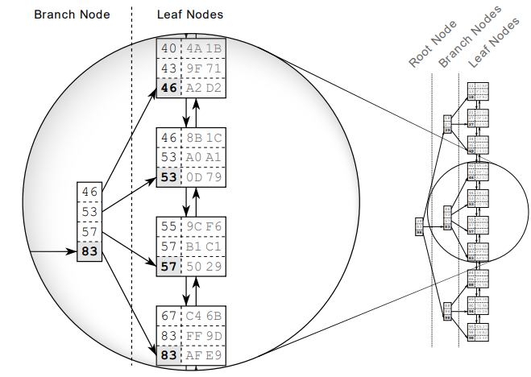
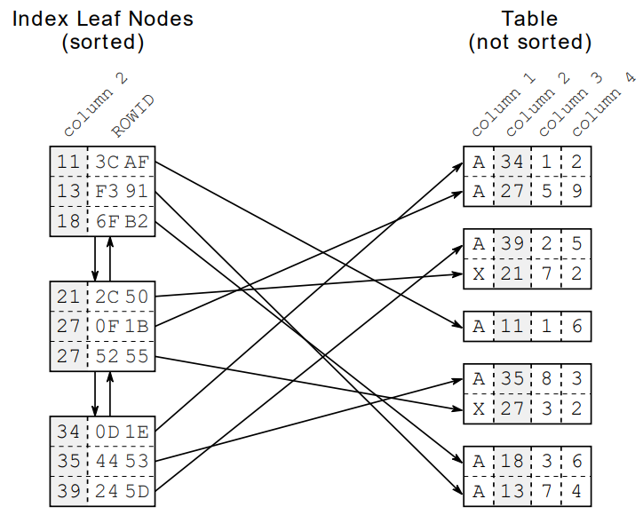
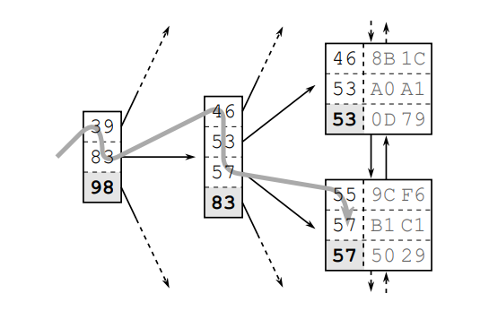
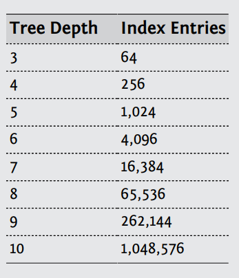
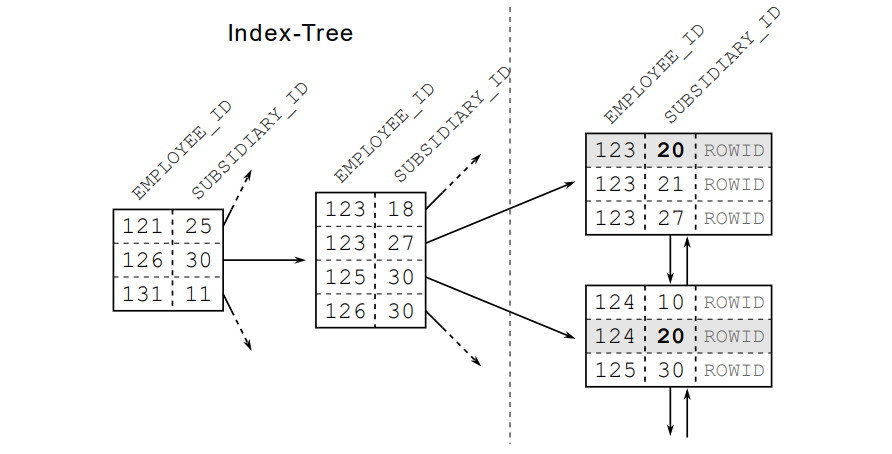
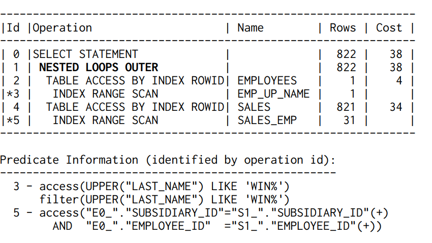
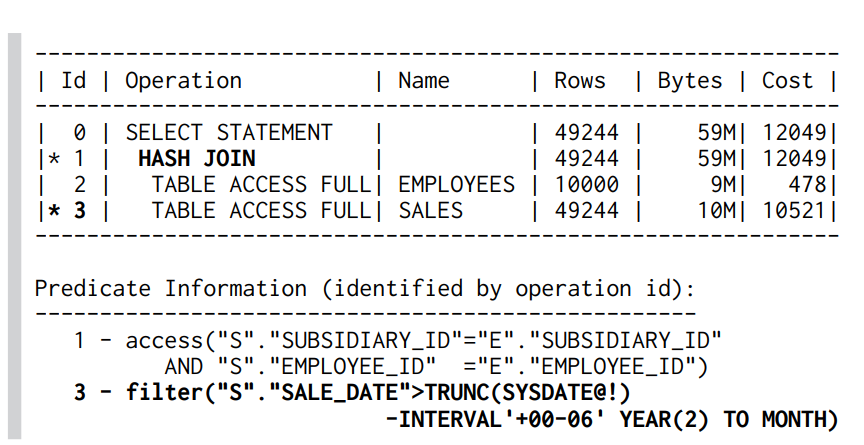
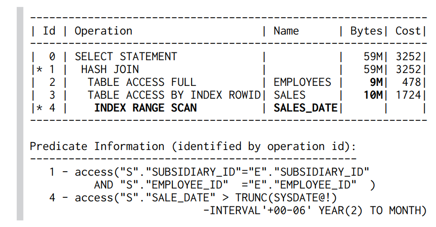
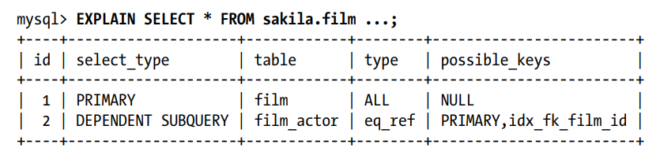
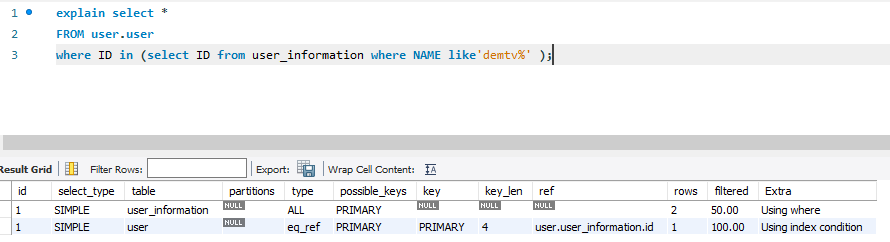

# SQL Performance

SQL là một ngôn ngữ không còn xa lạ với mọi lập trình viên và đối với với lập trình viên backend
việc làm chủ được SQL là một điều rất quan trọng. Trong quá trình làm việc của mình với SQL mình 
đã tham khảo rất nhiều nguồn để tối ưu câu truy vấn hiểu được hoạt động của SQL. Các bài nói về
tối ưu với SQL trên mạng là rất nhiều nhưng mình chưa tìm thấy có một bài nào tổng hợp các kỹ thuật nên dùng
để tối ưu với SQL. Bài viết này mình sẽ chia sẻ những kỹ thuật mình đang sử dụng để **tối ưu** hệ
thống của mình với **SQL** cụ thể hơn là **Mysql** vì nhiều kiến thức mình chưa thử ở các loại **SQL** khác. 

Bài này sẽ **dựa trên kinh nghiệm cá nhân** nên mong được sự đóng góp của mọi người. Mình **cập nhật bài viết này liên tục** 
để update những kỹ thuật mới nhất mình sử dụng.

Nội dung bài sẽ gồm các phần chính sau :

1. [What is index?](#what-is-an-index-)
2. [Create Index for optimise query](#create-index-for-optimise-query)
3. [Join](#join)
4. [Chopping up a query](#chopping-up-a-query)
5. [partition](#partition)
6. [Type of column](#type-of-column)
7. [Bulk insert/update](#bulk-insertupdate)
8. [Paging](#partition)
9. [Query Strategery](#query-strategery)

## What is an index ?

Index là một khái niệm rất quan trọng trong SQL, mọi người nghe thấy nó và sử dụng nó hằng ngày
nhưng không hẳn mọi người đều có thể hiểu được cách một **Database** xây dựng **index**. Do đó
khi một câu **query** của mọi người bị chậm thì rất khó có thể tạo ra **index** tối ưu.

Theo mình tìm hiểu thì các **SQL** database thường sẽ tổ chức **index** dưới 2 dạng:
- **B-tree** : Dựa theo kiến trúc của cây cân bằng. Hỗ trợ đa dạng query hơn.
- **Hash** : Dựa theo cấu trúc dữ liệu **Hash-Table**. Dạng này sẽ hỗ trợ dạng `=` rất tốt nhưng lại không hỗ trợ dạng `range query (>,<,>=,<=)`

**Hash** ít được dùng hiện nay và mình cũng chưa từng sử dụng nó trong **project** thực tế nên bài này mình chỉ nói đến 
dạng **B-tree**.

Các hình ảnh dưới đây mình lấy từ [SQL Performance explained](https://www.amazon.com/Performance-Explained-Everything-Developers-about/dp/3950307826).
Mọi người mua sách ủng hộ tác giả nhé. Quyển sách rất hay dạy chúng ta mọi thứ liên quan đến **index**.


### Index data structure
Để hiểu được **index** chúng ta cần phải biết được cấu trúc dữ liệu của một **index**. Giả sử ta tạo một index trên **column 2** dạng số.
**Database** sẽ tạo ra một dạng cấu trúc dữ liệu **B-tree** dựa theo các dữ liệu có trong **column 2** và các dữ liệu này sẽ được **sắp xếp** như hình bên dưới.
 


#### Leaf Nodes
Trong hình bên trên chúng ta sẽ chú ý đến các **Leaf Nodes** các **Node** này sẽ cung cấp cho chúng ta **địa chỉ** để đọc dữ liệu từ bảng được lưu
trong cơ sở dữ liệu. 

Tất nhiên sẽ có các **Leaf Nodes** không được các **Branch Node** trỏ tới nên các **Leaf Node** nãy sẽ được liên kết với nhau bằng **danh sách liên kết đôi** 
để đảm bảo được việc duyệt dữ liệu trong cây **index**.



#### Index Traversal
Tiếp đến chúng ta sẽ xem xét đến cách duyệt dữ liệu trên **index** để biết được tại sao nó lại nhanh hơn với việc **scan** table rất nhiều. 

Giả sử chúng ta tìm dữ liệu bản ghi có giá trị là **57**. **Database** sẽ bắt đầu duyệt từ gốc của cây **index** qua các **Branch Node** khác nhau 
cho đến khi đến đầu của **Leaf Nodes**. Tiếp tục duyệt theo qua các **Leaf Node** để tìm được giá trị **57**.

Vì cây **index** đã được sắp xếp nên việc duyệt này sẽ rất nhanh và phụ thuộc vào **độ sâu của cây** và số lượng dữ liệu có trong 1 **Node** (vài **KB** và không đổi).



Với các thuật toán phát triển cây **index** thì cây **index** sẽ được gọi là **đứa trẻ còi cọc** so với độ phát triền của các **Leaf Nodes** vì vậy duyệt
cây **index** cho chúng ta tốc độ nhanh hơn **scan** table. 

Theo ví dụ bên trên thì một **Branch Node** sẽ chứa 4 giá trị vậy ta sẽ tính được độ sâu của cây theo công thức sau : `Log4(số lượng phần tử của Branch Node)`.

**Database** sẽ tối ưu việc chọn số lượng phần tử sẽ tham gia cây **index** sao cho cây có độ sâu thấp nhất.

Ta có bảng dữ liệu sau để thấy rõ hơn độ lớn của cây sẽ phát triển chậm như thế nào nếu mỗi **Branch Node** có 4 phần tử.



### Create Index for optimise query
Chúng ta đã hiểu **index** là gì và tại sao khi sử dụng **index** lại cho chúng ta kết quả tốt hơn. Việc tiếp theo là áp 
dụng vào các trường hợp thực tế.

Có một lưu ý là trường bạn dùng để đánh **index** thì nên ít giá trị `Null` vì giá trị này gây khó cho **database** trong quá trình tạo cây **index**

#### Where Clause

##### query1
```sql
 SELECT first_name, last_name
 FROM employees
 WHERE employee_id = 123
```
Với câu query này chúng ta chỉ cần tạo **index** theo trường `employee_id` để đạt được tốc độ tối ưu cho câu query.

##### query2
```sql
 SELECT first_name, last_name
 FROM employees
 WHERE employee_id = 123 and subsidiary_id = 30
```

Giả sử `employee_id` không còn là **unique** nữa (trường hợp hợp nhất 2 công ty chẳng hạn) 
thì việc đánh **index** trên một trường `employee_id` sẽ không phải cách tối ưu nhất dành cho câu query trên.

Tại đây chúng ta cần đánh **index** trên 2 trường `employee_id` và `subsidiary_id`. 

Việc đánh query trên >=2 trường khác nhau được gọi là **concatenated index**. Việc đánh **index** khiến **database** sắp
xếp dữ liệu theo theo trường đứng đầu trước sau đó sẽ sắp xếp theo trường thứ 2. 

Vậy nên việc chọn thứ tự các trường trong **index** dạng này là rất quan trọng ảnh hưởng trực tiếp đến hiệu năng của **index**.



Lời khuyên của mình cũng như sách mình đọc và nghiên cứu thì hãy chọn trường có **selective** nhất đứng đầu tiên. Vì các trường
đó có tính **chọn lọc cao** (**selective**) thì khi tạo cây **index** sẽ có độ sâu thấp hơn. Điều này đúng cho các loại
**database** có khái niệm **concatenated index**.

##### query3
```sql
 SELECT first_name, last_name
 FROM employees
 WHERE employee_id between 123 and 500 
   and subsidiary_id = 30
```

Tương tự như câu **query2** tại đây việc `employee_id` là **unique** thì chúng ta cần phải đánh **index** trên cả 2 trường.
và ưu tiên điều kiện bằng `=` trước như thế sẽ tối ưu được câu **query**


##### query4
```sql
 SELECT first_name, last_name
 FROM employees
 WHERE employee_id between 123 and 500
```

```sql
 SELECT first_name, last_name
 FROM employees
 WHERE employee_id between 123 and 500 
   and subsidiary_id = 30
```
Chúng ta có 2 query thì chúng ta chỉ cần tạo 1 **index** cho 2 trường `employee_id` và `subsidiary_id`  với `employee_id` đứng đầu.
Vì dữ liệu sẽ được sắp xếp theo `employee_id` nên chúng ta sẽ dùng được **index** này cho 2 câu **query**. Mặc dù cách đánh **index** như
**query3** mới là tối ưu nhất nhưng cũng nên tạo ít **index** hơn.

Đến đây mọi người tự suy luận tiếp về đánh **index** cho lớn hơn 2 trường nhé chỉ cần nhớ là **index** là cây sắp xếp và duyệt **index**
giống duyệt cây là có thể suy luận ra thôi.

##### query5
```sql
SELECT first_name, last_name, date_of_birth
 FROM employees
 WHERE UPPER(last_name) = "DEMTV"
```

Việc sử dụng các **function** trong câu **query** thì **phải** đánh index cả **function** chứ không đánh trên trường được.

Tại đây chúng ta tạo **index** như sau `CREATE INDEX emp_up_name  ON employees (UPPER(last_name));`

##### query6
```sql
SELECT first_name, last_name, date_of_birth
 FROM employees
 WHERE UPPER(last_name) < ?
 AND date_of_birth < ?
```

Nếu câu **query** dạng này thì không thể đánh 1 **index** để thỏa mãn 2 **range** query được. 

Vì vậy tại đây mình sẽ chọn đánh **index** trường nào có khả năng sau khi lọc bằng **index** xong ít phải lọc trong **database** nhất có thể.
Hoặc có thể đánh 2 **index** cho cả 2 trường để **database** thực hiện merge dữ liệu và được gọi là **Index Merge**. 

Câu hỏi nếu cùng câu **query** sử dụng 1 **index** có thể giúp bạn quét hết trường hợp và việc tạo 2 **index** để **database** gộp lại thì chọn cái nào?
Tất nhiên là chọn 1 **index**.

##### slow index
Index cho câu query thực hiện nhanh hơn điều này quá quen rồi nhưng bạn có thể tạo **index** cho **query** thực hiện chậm hơn hay không?

Câu trả lời là có nhé. Việc Tạo **index** không cẩn thận không hề giúp câu **select** của bạn nhanh hơn ngược lại khiến nó chậm hơn và hiển nhiên
index sẽ khiến cho **insert**, **update** cũng chậm hơn dẫn đến thiệt cả 2 đường.

```sql
select *
from users 
where sex='M' and name='demtv'
```

Tại đây nếu bạn không nắm chắc về **index** có thể bạn sẽ tạo **index** trên trường `sex`.

Với câu query này và trong bảng **users** lớn và chỉ chứa 90% là `sex='M'` điều này sẽ khiến **query** này nếu dùng **index** sẽ chậm hơn với việc
**scan** toàn bộ bảng. 

Lý do khiến câu **query** trên chậm mặc dù đã sử dụng **index** là vì khi **database** sử dụng **index** trên thì nó sẽ nhận được các địa 
chỉ **ngẫu nhiên** **không nằm cạnh nhau** trong bảng. Tiếp đó nó sẽ phải lân lượt đi vào từng địa chỉ này để lọc ra dữ liệu. 

Điều này sẽ là chậm hơn rất nhiều việc **scan** bảng từ đầu đến cuối vì việc **scan** sẽ chỉ là đọc các bản ghi liên tiếp nhau.

Tất nhiên thực tế sẽ không ai đánh **index** kiểu thế cả nhưng mọi người cần phải chú ý trường hợp sau khi lọc qua **index** rồi mà vẫn phải
duyệt **quá nhiều** dữ liệu trong bảng. Tuân theo nguyên tắc chọn trường **selective** đánh **index** là một cách tránh được trường hợp này.

##### order by, group by
Việc đánh **index** cũng giúp ích rất nhiều đến các câu **query** **order by** hay **group by** vì làm trên tập sắp xếp lúc nào chẳng tiết kiệm hơn.

## Join

Một trong các phép quan trọng hay được sử dụng nữa là phép tính **Join** và nắm được một số nguyên tắc cơ bản để giúp **join** nhanh hơn là điều cần thiết.

Có 2 thuật toán chính được các **database** sử dụng khi thực hiện **join** 2 bảng dữ liệu đó là:
- Hash Join (**Mysql** version 8 trở lên mới hỗ trợ thuật toán **join** này)
- Nested Loop Join

### Nested Loop Join

Đây là thuật toán phổ biến nhất và được áp dụng trong rất nhiều loại **database** khác nhau vậy nên ta sẽ tìm cách tối ưu phép tính **join** này trước.
Nghe tên thì chắc các bạn cũng đoán ra được là nó sẽ thực hiện 2 vòng lặp để kiểm tra giữ liệu của 2 bảng.

Ta có **query** sau:
```sql
SELECT e0_.employee_id AS employee_id0
       -- MORE COLUMNS
FROM employees e0_
        JOIN sales s1_
                   ON e0_.subsidiary_id = s1_.subsidiary_id
                       AND e0_.employee_id = s1_.employee_id
WHERE UPPER(e0_.last_name) LIKE 'WIND%';
```

Và chúng ta tạo 2 index :
```sql
CREATE INDEX emp_up_name ON employees (UPPER(last_name));
CREATE INDEX sales_emp ON sales (subsidiary_id, employee_id);
```

Chúng ta sẽ có **query plan** sau :



Ở đây ta thấy **Database** đã sử dụng cả 2 **index** để thực hiện phép **join** sẽ nhanh hơn.
- **emp_up_name** để **access** và **filter** trường **last_name**
- **sales_emp** để thực hiện phép tìm kiếm tất cả những bản ghi tìm thấy sau khi `UPPER(e0_.last_name) LIKE 'WIND%';` trong bảng `sales`

Như thế **kết luận** rằng đánh **index** trên trường dùng để **join** sẽ khiến cho câu **join query** sẽ nhanh hơn.

Vậy chúng ta đánh 3 **index** liệu rằng có giúp câu **query** nhanh hơn không?

```sql
CREATE INDEX emp_up_name ON employees (UPPER(last_name));
CREATE INDEX sales_emp ON sales (subsidiary_id, employee_id);
CREATE INDEX emp_up_emp ON sales (subsidiary_id, employee_id);
```
Câu trả lời là hoàn toàn không? Việc **database** sử dụng thuật toán **Nested Loop Join** thì chúng ta chỉ cần đánh **index** cho bảng nằm bên phải mà thôi.

Ví dụ Khi thực hiện **join** bảng **A,B** bằng trường **c** thì ta chỉ cần đánh **index** trên trường **c** của bảng **B** mà thôi.
Nhưng thực tế **database** **không nhất thiết** sẽ dữ lại thứ tự **join** cho bạn vì khi thay đổi thứ tứ **join** thì vẫn giữ được kết quả cuối
nhưng sẽ ảnh hưởng rất nhiều đến **performance** của **Database**. 

Có một quy tắc chung là **Database** sẽ luôn sắp xếp sao cho nó ít phải **lookup** bên bảng còn lại càng ít càng tốt. Theo **query** bên trên dù ta đảo ngược 
lại vị trí của bảng `employees` và bảng `sales` thì **database** vẫn sẽ đảo lại thứ tứ để đưa ra phương án **join** tốt nhất.

Lời Khuyên là nếu bạn không chắc chắn biết được bảng nào sẽ là bảng bên **phải** thì hãy nên sẽ dũng **explain query**. Và đừng **join** nhiều bảng quá không 
bộ **optimize** của **Database** sẽ hơi vất vả chọn thứ tự cho bạn đấy. 

### Nested Loop Join With ORM

Thực tế hiện nay chúng ta thường xuyên sử dụng **ORM** để thao tác với **Database** vậy nên chúng ta nên biết được **ORM** sẽ thực hiện phương
pháp **Nested Loop Join** này như thế nào.

Nếu không cẩn thận thì khi sử dụng **ORM** rất có khả năng bạn sẽ gặp phải 1 vấn đề là **N+1 select problem**. Thay vì gửi 1 câu lệnh **Join** lên 
**database** để nhận lại kết quả thì **ORM** bạn đang dùng sẽ gửi **N+1** câu query khác nhau để lấy dữ liệu về. 

Ví dụ như câu query trên rất có thể loại **ORM** của bạn sẽ thực hiện các phép tính sau:
```sql
select employees0_.subsidiary_id as subsidiary1_0_
 -- MORE COLUMNS
 from employees employees0_
 where upper(employees0_.last_name) like ?

 select sales0_.subsidiary_id as subsidiary4_0_1_
 -- MORE COLUMNS
 from sales sales0_
 where sales0_.subsidiary_id=?
 and sales0_.employee_id=?

 select sales0_.subsidiary_id as subsidiary4_0_1_
 -- MORE COLUMNS
 from sales sales0_
 where sales0_.subsidiary_id=?
 and sales0_.employee_id=?
```
Đầy tiên sẽ **query** lấy ra các bản ghi **employee** trước sau đó với từng bản ghi **employee** sẽ thực hiện 1 câu **select** nữa để lấy kết quả.
Thực sự đây đúng là điều mà **database** thực sự sẽ làm khi bản gửi một câu **join query** đầy đủ với thuật toán **Nested Loop Join** nhưng nó sẽ tiết
kiệm được rất nhiều thời gian giao tiếp giữa **server** và **client**.

Vậy nên các bạn nên tránh sảy ra trường hợp này nếu bạn thật sự muốn **join** 2 bảng. Hãy **show sql** của **ORM** bạn đang sử dụng ra để kiểm tra
và **search** trên mạng cách khác phục nhé.

### Hash Join

Đây là một thuật toán giúp ta tiết kiệm thời gian join hơn rất nhiều so với **Nested Loop Join** vì nó sẽ sử dụng cấu trúc dữ liệu **Hash Table** để lưu 
dữ liệu của 1 bảng lại. Nhưng không có gì là hoàn hảo cả vì sử dụng **hash table** nên nó sẽ rất tốn bộ nhớ.

Ta có query sau :
```sql
SELECT *
 FROM sales s
 JOIN employees e ON (s.subsidiary_id = e.subsidiary_id
 AND s.employee_id = e.employee_id )
 WHERE s.sale_date > trunc(sysdate) - INTERVAL '6' MONTH
```
Ta sẽ có **query plan** cho query này:



**Database** sẽ load hết dữ liệu 1 bảng vào **hash-table** trước như ở đây ta thấy nó sẽ load bảng **employees** vì nó có kích thước nhỏ hơn.
Với dạng **Join** này chúng ta chỉ cần đánh **index** tại **where** vì khi thực hiện **join** nó đã sử dụng **hash-table** nên việc **index** cho 
trường cần **join** là **không cần thiết.**

Ta tạo **index** sau và sẽ có một **query plan** :


Vậy việc biết được **database** bạn đang sử dụng đang sử dụng **join algorithms** nào là điều rất cần thiết để biết được cách nâng cao hiệu năng của 
phép **join**. 

Theo như tài liệu của **Mysql** thì phiên bản **8.0.18** mới hỗ trợ loại **join** này và nó cũng sẽ cung cấp cho bạn một số config như : join_buffer_size, open_files_limit. 
Bạn nên tham khảo tại Link [Mysql-Doc](https://dev.mysql.com/doc/refman/8.0/en/hash-joins.html). Tại đây sẽ mô tả cho bạn biết khi nào sẽ dùng **hash join** và cách tối ưu phép
tính toán này.

## Join Decomposition
**Join Decomposition** là kỹ thuật dùng để tách một câu **join** của bạn thành nhiều câu **query** khác nhau và sẽ thực hiện **join** trên **Application** 
của bạn để tối ưu hóa được các loại **cache** bạn đã lưu cũng như mở rộng **database**.

Cụ thể ta xét **query** sau :
```sql
SELECT * FROM tag
JOIN tag_post ON tag_post.tag_id=tag.id
JOIN post ON tag_post.post_id=post.id
WHERE tag.tag='mysql';
```
Nếu sử dụng kỹ thuật **Join Decomposition** thì sẽ biến thành 3 câu **query** như sau:

```sql
SELECT * FROM tag WHERE tag='mysql';
SELECT * FROM tag_post WHERE tag_id=1234;
SELECT * FROM post WHERE post.id in (123,456,567,9098,8904);
```
Bạn nhìn thấy sự lãng phí nhưng nếu bạn đã **cache** được bảng **tag** và bảng **tag_post** trong **memory** của **Application** thì nó chỉ cần 
thực hiện đúng **query** cuối mà thôi. Điều này tận dụng tối đa **cache** của bạn cũng như khiến **Application** nhanh hơn.

Một ưu điểm nữa là ba bảng **tag**, **tag_post**, **post** có thể lưu ở các **server** khác nhau điều đó khiến mở rộng **database** là dễ.

Trên thực thế phương pháp này được sử dụng rất nhiều trong các **high-performance applications** và chúng ta cũng hoàn toàn áp dụng được nó
vì thực tế trừ màn hình dành cho **admin** các phép **join** đều khá đơn giản.

### IN
Với **Mysql** version **5.7** thì bạn làm ơn đừng sử dụng câu **query** dạng này :
```sql
 SELECT * FROM sakila.film
 WHERE film_id IN(
 SELECT film_id FROM sakila.film_actor WHERE actor_id = 1);
```
Vì nếu bạn mong muốn **Mysql 5.7** se thực hiện **sub query** trong lệnh **IN** trước thì nó làm ngược lại đó. Hãy nhìn cách nó làm


Nó sẽ quét hết bảng `film` trước sau đó với thực hiện so sánh với **sub query**. Nếu dùng **Mysql 5.7** thì bạn nên thay đổi nếu có 
**query** dạng này sang dạng **join**. Đến phiên bản **Mysql 8** thì điều này đã được cải tiến nó sẽ thực hiện câu **sub query** trước.



## Chopping Up a Query
Kỹ thuật này mình dùng nhiều trong quá trình **xóa** dữ liệu với các bảng không có **partition** theo **range**.

Nghĩa là thay vì **xóa 1 năm dữ liệu** thì mình sẽ viết code để xóa từng tuần 1 điều này khiến **query** của mình thực hiện nhanh hơn và 
khiến **database** phải **lock** dữ liệu ít hơn dẫn đến **database** không bị cao tải. Trước khi biết đến điều này mình đã phải chờ hàng
tiếng đồng hồ để **database** thực hiện phép **delete** và nhiều khi mình phải **Kill** câu **query** ngu ngốc đó đi. Hy vọng các bạn không
trải qua những thứ đau thương như mình.

Một ví dụ điển hình nữa là khi **alter** một bảng lớn trong **sql**. Các bạn chắc trải qua cảm giác câu lệnh **alter** của mình sẽ chạy mất
hàng tiếng đồng hồ có khi là hơn thế nữa. Nguyên nhân của việc này là **sql** sẽ tạo ra một bảng mới và **copy** tất cả dữ liệu của bảng cũ
sang bảng mới và trong suốt quá trình này bảng cũ sẽ bị **locked**. Nếu bảng cần **alter** có **size** quá lớn thì đây là vấn đề.

Áp dụng **Chopping Up a Query** ta sẽ làm như sau. Tạo một bảng mới sau đó **copy** từng chút một từ bảng mới sang bảng cũ (khoảng tầm 1000 row). Nhưng trong quá
trình **copy** này sẽ có luồng thay đổi giá trị của bảng cũ như : **delete**,**update**,... Bạn cần tạo thêm các **trigger** để khi có update vào bảng **cũ** thì 
sẽ **update** vào bảng mới luôn hoặc **update** ra một bảng lưu thay đổi nữa cuối cùng sẽ thực hiện **update** giá trị của bảng thay đổi vào bảng **mới**.

Có một cách nữa để không phải dùng **trigger** mình để Link **github** cho các bạn tham khảo : https://github.com/github/gh-ost  

## Partition
Cùng với việc tạo **index** thì việc tạo **partition** cũng giúp câu **query** của bạn có tốc độ nhanh hơn.

**Partition** trong **sql** sẽ phân chia bảng của bạn ra thành nhiều bảng nhỏ hơn. Do đó khi câu query của bạn phù hợp với **partition** nào
thì **database** chỉ cần đọc **partition** đó lên thôi điều này sẽ giúp câu **query** nhanh hơn nhiều. 

**Partition** rất được chú trọng trong các **distributed** database nhất là với các loại **noSql** nó được nhắc đến rất nhiều. Vì khi chia **partition**
một cách hợp lý thì **partition** sẽ có thể được lưu ở các server khác nhau khiến cho tăng được hiệu năng **query** vì câu **query** của bạn sẽ được
tính toán trên nhiều máy thay vì 1 máy.

Trong Sql thì mình dùng chủ yếu dạng **range partition** chia dữ liệu của mình theo thời gian để thực hiện **query** nhanh hơn và khi cần thì
xóa 1 **partition** sẽ nhanh hơn rất nhiều việc xóa bằng lệnh **delete**.

Có 2 dạng **partition** :
- Hash
- Range

### Lưu ý khi chia partition

Một bảng trong **Sql** của bạn có nhiều **partition** thì thực tế nó sẽ là một bảng **Logic** chứa nhiều bảng **Vật lý** bên dưới. Nghĩa là khi bạn
tạo **index** trên bảng có **partition** thì nó sẽ là **index** của nhiều bảng khác nhau. 

Vậy nên khi **query** dữ liệu mà nằm trên nhiều **partition** thì mặc dù bạn đã **index** trên trường dùng để **partition** nhưng nó sẽ là **query** trên nhiều bảng khác nhau và dùng 
nhiều cây **index** khác nhau  điều đó khiến câu **query** sẽ không tận dụng được tối đa **index** cũng như **partition**.

Vậy với **partition** dạng **range** thì đừng chia  **range** quá nhỏ (mỗi ngày một **partition**) và số lượng **partition** có thể có cũng có giới hạn
ví dụ **Myslq** sẽ có tối đa **8192** cho một bảng dữ liệu.


## Type of column

Khi thiết kế **database** thì chỉ nên chọn kiểu dữ liệu vừa đủ cho cột bạn đang sử dụng. Kiểu dữ liệu càng nhỏ sẽ giúp **CPU** tính toán càng nhanh
cũng như chiếm dung lượng nhỏ khi lưu.

Một sai lầm phổ biến mình thấy các bạn hay mắc đó là dùng **string** để lưu kiểu số. Và dùng các kiểu số quá lớn để lưu số nhỏ.


## Bulk insert/update
### insert
Câu hỏi là bạn muốn **insert** **1 triệu** dữ liệu vào **database** thì cách nào sẽ là cách tối ưu nhất. Nhiều bạn sẽ trả lời ngay là sử dụng 
**batch insert** của các **framework** của các bạn hay sử dụng. Điều đó đúng nhưng chúng ta nên biết câu lệnh **sql** sẽ là gì và các bạn khi
sử dụng các **orm framework** cũng nên cẩn thận vì nó cũng có rất nhiều cú lừa.

Câu lệnh **insert** dữ liệu một cách nhanh nhất vào **database** là dạng :
```sql
INSERT INTO tbl_name (a,b,c) VALUES(1,2,3),(4,5,6),(7,8,9);
```
Một số **ORM** sẽ sử dụng dạng **Batch** như sau để **insert** vào **database** :
```sql
set autocommit = 0;
INSERT INTO tbl_name (a,b,c) VALUES(1,2,3);
INSERT INTO tbl_name (a,b,c) (4,5,6);
INSERT INTO tbl_name (a,b,c)(7,8,9);
commit 
```
Đây sẽ là gửi nhiều câu **insert** lên một lúc không phải dạng **bulk insert**. Để khắc phục điều này thì bạn nên sử dụng một config của
**jdbc** là `rewriteBatchedStatements=true`. Trước khi gửi lên **sql server** thì **jdbc** sẽ thực hiện **rewrite query** của bạn thành dạng
có thể **insert** nhanh nhất.

### update
Bây giờ mong muốn **update** **1 triệu** dữ liệu vào **database** thì cách nào sẽ là nhanh nhất. Cũng tương tự như **insert** các **database** cung
cấp cho chúng ta **query** sau để thực hiện **update** nhanh nhất.
```sql
INSERT into `table` (id, fruit)
    VALUES (1, 'apple'), (2, 'orange'), (3, 'peach')
    ON DUPLICATE KEY UPDATE fruit = VALUES(fruit);
```
Có thể sử dụng thêm lệnh **IF** của **SQL** để xác định **update** giá trị mới hay là giữ nguyên giá trị cũ khi thực hiện **update**

Bạn tham khảo tại Link sau : https://dev.mysql.com/doc/refman/8.0/en/insert-on-duplicate.html

### Paging in SQL

Khi học trong trường đại học và các bài tutorial dành cho người mới mình đã từng đọc cũng như các **framework** nổi tiếng đang thực hiện phân trang bằng query này.

```sql
SELECT film_id, description FROM sakila.film ORDER BY title LIMIT 50, 5;
```
Điều này sẽ trở lên **rất tốn chi phí** nếu **offset** của bạn quá lớn giả sử  **LIMIT 10000, 20** thì **database** sẽ thực hiện tạo ra **10020** của
câu **query** và sau đó vât đi **10000** kết quả.

Mình **Khuyên** mọi người nên chuyển sang một dạng **query** khác như :
```sql
SELECT * FROM sakila.rental
  WHERE rental_id < 16030
 ORDER BY rental_id DESC LIMIT 20;
```
Dạng này thì bạn cần một trường **unique**. Mình sẽ để [Link](https://www.eversql.com/faster-pagination-in-mysql-why-order-by-with-limit-and-offset-is-slow/) 
để mọi người tham khảo tốc độ **query** sẽ tốt hơn như thế nào khi chuyển sang dạng này.

Với dạng **paging** theo kiểu **limit,order by** mình thường xuyên sử dụng trong các **job** tạo báo cáo vì nó giúp mình lấy hết dữ liệu ra nhưng không gây
**out of memory** cũng như nhanh hơn kiểu **limit,offset** rất nhiều vì dữ liệu cần lấy sẽ khiến cho **offset** là rất lớn.

Một điểm tối ưu nữa của phương pháp này là rất có thể **order by** sẽ tận dụng được **index**. 


## Query Strategery
Khi thực hiện **select** **Mysql** cung cấp cho các bạn 3 loại **query** khác nhau:
- normal
- cursor
- stream 
  
Thật sự cách đây một năm thì mình không biết được là **Mysql** cung cấp cho chúng ta 3 loại **query** khác nhau cho đến khi mình gặp bài toán cần phải
lấy một lượng lớn **dữ liệu** trong **Mysql** ra một cách nhanh nhất và không gây **out of memory**. Trước đó mình đã sử dụng dạng cải tiến của **Paging**
như đã trình bày ở bên trên nhưng nó vẫn chưa phải là cách nhanh nhất.

Mình sẽ đính kèm Link về các dạng **query** này : https://dev.mysql.com/doc/connector-j/8.0/en/connector-j-reference-implementation-notes.html

### normal
Bạn cần lấy hết dữ liệu của bảng **film** để lưu xuống file. Bạn thực hiện câu **query** sau : 
```sql
SELECT * FROM sakila.film;
```
Khi các bạn sử dụng **ORM** để lấy dữ liệu ra và nó sẽ **load** hết dữ liệu vào **RAM** của bạn và nếu bảng **film** to quá thì nó sẽ gây lên **out of memory**.

Tại đây bạn nghĩ mình nên sử dụng trực tiếp **jdbc** để lấy dữ liệu ra vì nó trả kết quả vào các **Resultset** và có các hàm `next()` để lấy dữ liệu và bạn hy vọng nó sẽ
cache 1 phần dưới **Application** và khi nào hết sẽ thực hiện gọi lên **mysql server** để lấy kết quả về. Bạn vui vẻ thực hiện và kết quả vấn là **out of memory**.

Khi bạn không **config** gì đặc biệt thì **jdbc** sẽ sử dụng dạng **query** này cho bạn. Nó sẽ lấy hết dữ liệu từ **sql server** xuống lưu trong **RAM** và
bạn sẽ lấy kết quả từ **RAM** ra. 

Dạng này sẽ phù hợp với hầu như mọi yêu cầu của bạn trừ trường hợp bạn muốn lấy quá nhiều dữ liệu. Nếu muốn lấy quá nhiều dữ liệu mà không muốn
**out of mem** thì hãy sữ dụng **Paging** kết với với dạng **query** này.

### cursor
Cũng đề bài như trên nhưng với một số **config** nhỏ như sau:

```java
conn = DriverManager.getConnection("jdbc:mysql://localhost/?useCursorFetch=true", "user", "s3cr3t");
stmt = conn.createStatement();
stmt.setFetchSize(100);
rs = stmt.executeQuery("SELECT * FROM your_table_here");
```
Khi thực hiện câu **query**
```sql
SELECT * FROM sakila.film;
```
thì nó sẽ không **fetch** hết dữ liệu về **Application** cho bạn nữa và chỉ giới hạn **100** kết quả một lần nó sẽ không gây tăng memory cho hệ thống
của bạn. 

Nhưng khi sử dụng dạng **query** này nó có các nhược điểm sau :
- Tăng tải lên **sql server** : Server sẽ phải thực hiện tính toán câu **query** sau đó tạo một vùng nhớ tạm thời để lưu kết quả của câu **query** sau khi
lưu hết kết quả vào vùng nhớ tạm thời đó thì mới trả lại cho **client** cuối cùng sẽ xóa vùng nhớ đó đi. Điều này thật sự tốn kém đó.
- Kết quả sẽ lâu hơn vì phải chờ **server** lưu kết quả xuống ổ đĩa xong thì mới có thể trả lại kết quả cho **client**

Mình nghĩ không nên dùng loại này.

### Stream 
Đây là dạng **query** nhanh nhất bạn có thể sử dụng để lấy dữ liệu từ **mysql** ra và không gây **out of memory**. 

Cũng là đề bài của loại **normal** với các config sau **jdbc** và **server** sẽ thực hiện trả kết quả dưới dạng **stream** :
```java
stmt = conn.createStatement(java.sql.ResultSet.TYPE_FORWARD_ONLY,
              java.sql.ResultSet.CONCUR_READ_ONLY);
stmt.setFetchSize(Integer.MIN_VALUE);
```
Với từng loại **ORM** khác nhau sẽ có cách cho các bạn **config** khác nhau nên ở đây mình chỉ **config** cho **jdbc**.

Với dạng này khi nào bạn thật sự cần dữ liệu thì nó mới **fetch** dữ liệu đó từ **server** về cho bạn. 

Nếu câu **query** của bạn quá phức tạp và việc sử dụng **paging** với dạng **normal** khiến mất quá nhiều thời gian thì bạn **mới** suy nghĩ
chuyển sang dạng **stream** này vì nó cũng có một số nhược điểm sau :
- Khi nhận được kết quả thì **connection** chưa thể sử dụng để thực hiện **query** mới được nếu bạn trả **connection** vào **pool** thì sẽ
sảy ra lỗi nếu hệ thống dùng **connection** đó **query** tiếp.
- Phải tốn chi phí duy trì **connection** đến khi lấy hết dữ liệu và nếu không may nó bị mất kết nối thì sẽ có lỗi sảy ra.

## Tổng kết
Bài này tổng hợp hết kiến thức của mình đã **thực sự** đã dùng trong các dữ án để nâng cao **hiệu năng** tổng thể khi làm việc với **mysql**.
Mình có thể **update** thêm vào bài này nếu mình tìm được một điều gì đó hay hơn hoặc là mình nhớ ra điều gì đó.

Vì đây là bài viết tổng hợp nên có rất nhiều phần mình chỉ tóm gón lại cách sử dụng nhưng chưa nói cụ thể tại sao lại như thế nên các bạn nên 
**search** các tài liệu khác để nắm rõ hơn những phần đó hoặc ủng hộ mình để mình ra phần tiếp theo nhé. Hãy **vote** sao vì nó miễn phí. 

Kiến thức mình có là do đồng nghiệp cung cấp khi làm các bài toán và từ 2 **quyển sách** rất tuyệt vời sau:
- SQL Performance Explain. Cảm ơn thầy **Trần Việt Trung** đã giúp em có kiến thức đầu đời này.
- High Performance Mysql. Cảm ơn anh **Lâm** đồng nghiệp đã cho em thêm 1 tài liệu hay.

Mình khuyên các bạn đọc bài này của mình là có chỗ nào không hiểu thì **đừng vội tin** những gì mình viết hãy **thực hành** luôn điều đó và khiến nó thành
kiến thức của các bạn mình cũng đã bị nhiều bài **tutorial** trên mạng lừa nhiều rồi nên bạn đừng tin ai cả. **Lập trình là môn thực hành**

Bài này là rất dài hy vọng các bạn có thể đọc hết và **vote** một sao trên **github** để ủng hộ mình nếu có ích cho các bạn.


